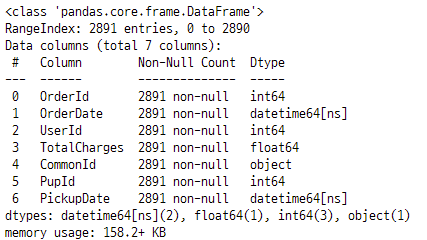
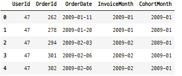

# 코호트 분석 케이스 1

### 1. 데이터 임포트

```python
df = pd.read_excel("https://github.com/springcoil/marsmodelling/blob/master/relay-foods.xlsx?raw=true", sheet_name="Purchase Data - Full Study")

df.head()
```


### 2. 데이터 확인, 전처리
- 데이터 길이, 컬럼별 데이터 길이, 타입 확인
```python
df.info()
```



- 데이터의 통계값 확인
```python
df.describe()
```


#### 1-1. 불필요 컬럼 제거
- OrderId, OrderDate, UserId 만 사용
- 제거하지 않아도 된다.

```python
df2 = df.drop(["CommonId", "PupId", "PickupDate", "TotalCharges"],
              axis=1)

df2.head(2)
```


### 2. OrderMonth 생성
- 주문날짜를 월별 형식으로 변환
- InvoiceMonth

```python
df2["InvoiceMonth"] = df2["OrderDate"].dt.strftime("%Y-%m")
df2.head(2)
```


### 3. CohortMonth 생성
- 코호트 그룹인 고객별 여러 주문날짜 중에서 첫 주문날짜

#### 3-1. 유저아이디를 인덱스로 설정

```python
df2 = df2.set_index("UserId")
df2.head(2)
```


#### 3-2. 유저별로 groupby한 후 주문날짜에서 가장 작은 값을 찾는다.

```python
firstorder = df2.groupby(df2.index)["OrderDate"].min()
firstorder_month = firstorder.dt.strftime("%Y-%m")
firstorder_month

>>>

UserId
47        2009-01
95        2009-03
98        2009-01
112       2009-01
141       2009-11
           ...
393616    2010-03
394290    2010-03
394346    2010-03
395039    2010-03
396551    2010-03
Name: OrderDate, Length: 757, dtype: object
```

#### 3-3. CohortMonth 컬럼 생성

```python
df2["CohortMonth"] = firstorder_month
df2.reset_index(inplace=True)
df2.head()
```




### 4. 분석용 테이블 생성 
- cohortmonth와 invoicemonth를 groupby 하여 유저의 방문횟수 계산
- 코호트 분석의 대상이 되는 코호트 그룹의 데이터

#### 4-1. groupby

```python
grouped = df2.groupby(["CohortMonth", "InvoiceMonth"])
grouped

>>>

<pandas.core.groupby.generic.DataFrameGroupBy object at 0x000001D37FFA9308>
```

#### 4-2. groupby한 객체에서 userid의 갯수를 중복없이 nunique()
- nunique() : unique 한 값의 갯수를 반환한다.

```python
n_user = grouped["UserId"].nunique()
cohorts_df = n_user.reset_index()
cohorts_df.rename(columns={"UserId" : "TotalUsers"}, inplace=True)
cohorts_df.head(3)
```


### 5. cohortperiod
- 첫 주문날짜 이후 다음 주문한 날짜들과의 차이
- 코호트 단위기간

#### 5-1. 2009-02월의 2010-03월 데이터 추가
- 코호트 그룹별 마지막 주문 월을 통일해주기위해 데이터 추가
    - 추가하고자 하는 위치의 인덱스의 중간 인덱스에 데이터를 생성
    - 실수로 바뀐 인덱스를 재정렬
    - 전체 인덱스를 리셋
- 데이터 추가하기 전

```python
cohorts_df[cohorts_df["CohortMonth"]=="2009-02"]
```


- 데이터 추가
- 2009-02월 그룹의 마지막 주문월인 2010-03월의 데이터가 추가 됐다.

```python
cohorts_df.loc[27.5] = ["2009-02", "2010-03", 0]
cohorts_df = cohorts_df.sort_index()
cohorts_df.reset_index(drop=True, inplace=True)
cohorts_df[20:30]
```


#### 5-2. CohortPeriod 생성
- CohortMonth의 갯수를 계산하고, 반복문에서 사용하여 0~n개의 데이터를 생성한다.

```python
n_cohortmonth = cohorts_df["CohortMonth"].value_counts()
n_cohortmonth

>>>

2009-01    15
2009-02    14
2009-03    13
2009-04    12
2009-05    11
2009-06    10
2009-07     9
2009-08     8
2009-09     7
2009-10     6
2009-11     5
2009-12     4
2010-01     3
2010-02     2
2010-03     1
Name: CohortMonth, dtype: int64
```

- 반복문을 사용하여 각 코호트그룹별 주문월의 갯수에 해당하는 단위기간 데이터를 생성한다.

```python
cohortperiod = []
for i in n_cohortmonth :
    for j in range(i) :
        cohortperiod.append(j)

cohorts_df["CohortPeriod"] = cohortperiod
cohorts_df.head()	
```


### 6. CohortMatrix 생성
- cohortmonth와 cohortperiod를 두 축으로 하는 테이블 생성
- unstack(멀티인덱스의 번호) : unstack() 사용할때 데이터로 사용할 컬럼명을 정해준다.

#### 6-1. cohortmonth와 cohortperiod 로 groupby
- groupby(["", ""])로 하면 객체만 생성된다.
- 멀티인덱스를 사용하면 groupby한 테이블을 데이터 프레임으로 반환해준다.
    - set_index(["", ""])

```python
cohort_df_2 = cohorts_df.set_index(["CohortMonth", "CohortPeriod"])
cohort_df_2.head(5)
```


#### 6-2. cohortmatrix
- 멀티인덱스로 만든 테이블에서 데이터로 사용할 컬럼을 설정 후
- unstack() : x축 설정 : 멀티인덱스의 0, 1 인덱스 값을 넣어 준다. 

```python
cohort_matrix = cohort_df_2["TotalUsers"].unstack(1)
cohort_matrix
```


### 7. RetentionMatrix 생성
- cohortmonth의 첫번째 단위기간의 데이터로 전체 데이터를 행별로 나누어준다.
    - axis=0

```python
retention_matrix = cohort_matrix.divide(cohort_matrix[0], axis=0)
retention_matrix = retention_matrix.round(2)
retention_matrix
```


### 8. 시각화

```python
%matplotlib inline
plt.figure(figsize=(10, 8))
sns.heatmap(retention_matrix, annot=True, fmt=".0%")
plt.show() ;
```


### 9. 인사이트
- 2009-01 월에 고객의 방문이 있었고, 재방문이 꾸준히 이어졌다.
- 재방문율 retention 이 가장 큰 그룹은 2009-01 월 방문 고객들이다.
- 2009-05월에 방문한 고객 그룹은 이후 재방문율이 상대적으로 낮다.
- 2010-01월 방문 고객의 첫 재방문율이 가장 높다.
- 데이터 시점에서 현재인 2010-03월에 재방문율은 각 그룹별로 전반적으로 낮다.

