# 코호트 분석 케이스 2

- 코호트 분석 지표를 사용하는 방식은 회사마다 다르다.

### 코호트 분석
- 코호트 : 동질집단
    - 4월에 구매한 유저 : 코호트 집단
    - 이 코호트 집단의 변화 (주로 retention)를 분석하는 것이 코호트 분석이다.
    
### 코호트 분석의 정의
- 기간, 속성(회원, 상품), 고객 관심사 등 여러가지 카테고리에서 공통된 특성을 갖는 유저를 찾는 분석방법이다.
    - **데이터를 압축하고 한눈에 확인하기 위해 만드는 피벗과 비슷한 방법론**
- 월별 가입 회원들의 집합 : 가입월을 기준으로 한 코호트 집단(동질집단)
- 가입일을 기준으로 한 집단들의 **retention(재구매, 재방문)** : 코호트 분석
- 최근에는 유저의 행동을 분석할 수 있는 환경이 많이 발전되었다.
    - **코호트분석=유저 행동 데이터 분석** 과 같은 의미로 쓰인다.
    - 트래픽, 로그데이터, 클릭수, 구매 전환 등의 데이터를 기반으로 한다.

### CRM 데이터 마케팅에서의 코호트 분석
- `코호트 분석의 목표는 비즈니스 인사이트를 얻는 것이다.`
- 마케팅에 필요한 고객의 특성을 파악하고 Action을 실행하거나, Action을 실행한 이후 고객의 행동 패턴을 분석한다. (마케팅 효과 분석의 측면)

# 코호트 분석

### 1. 라이브러리 임포트
- 데이터프레임 셋팅 : 컬럼갯수를 50개로 설정

```python
import pandas as pd
import numpy as np
import matplotlib.pyplot as plt
import matplotlib as mpl

pd.set_option("max_columns", 50)
mpl.rcParams["lines.linewidth"] = 2
```

### 2. 데이터 임포트
- 데이터 구조, 속성 확인
    - OrderId : 구매번호
    - OrderDate : 구매시간
    - UserId : 사용자번호
    - TotalCharges : 구매금액

```python
df = pd.read_excel("../../all_data/cohort_data/relay-foods.xlsx",
                  sheet_name="Purchase Data - Full Study")
df.head()
```

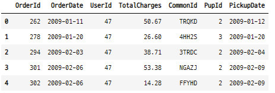

### 3. OrderMonth 
- 모든 주문날짜를 주문년-월 형식으로 변환
    - apply(lambda x : x.strftime(%Y-%m) : 2022-05 : str 타입

```python
df2 = df.copy()
df2["InvoicePeriod"] = df2["OrderDate"].apply(lambda x : x.strftime("%Y-%m"))
df2.head()
```

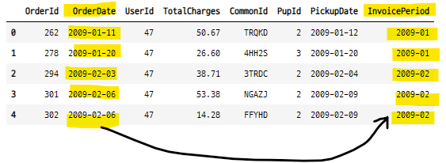

#### 3-1. dt.strftime() 함수를 사용해도 된다.

```python
df2["OrderDate"].dt.strftime("%Y-%m")

>>>

0       2009-01
1       2009-01
2       2009-02
3       2009-02
4       2009-02
         ...
2886    2010-03
2887    2010-03
2888    2010-03
2889    2010-03
2890    2010-03
Name: OrderDate, Length: 2891, dtype: object
```

### 4. CohortMonth
- 사용자별 첫구매월 추출
- UserId를 기준으로 groupby : set_index("UserId") 
- OrderDate의 최소 값 : 첫 구매월
- df.groupby(level=0) : UserId로 그룹화 한다.
    - UserId를 기준으로 OrderDate에서 가장 작은 값을 찾고 날짜 형식을 변환한다.
    - 즉 고객별로 최초 구매월을 찾는다.

```python
df2.set_index("UserId", inplace=True)
df2["CohortMonth"] = df2.groupby(level=0)["OrderDate"].min().apply(lambda x : x.strftime("%Y-%m"))
df2.head()
```

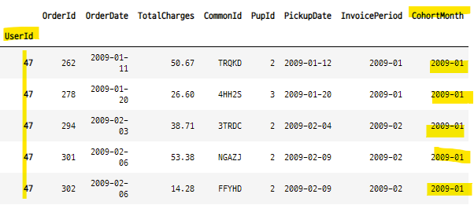


### 5. 고객수, 주문수, 총매출 합계
- 첫구매월과 구매월을 groupby 하고 나머지 컬럼의 통계값을 계산한다.
    - nunique() 는 unique() 값의 갯수를 세어준다.
    - agg{"UserId" : pd.Series.nunique}

```python
def count(x) : 
    return len(x)

grouped = df2.groupby(["CohortMonth", "InvoiceMonth"])
ttl_user = grouped["UserId"].unique().agg(count)
ttl_order = grouped["UserId"].unique().agg(count)
ttl_charge = grouped["TotalCharges"].unique().agg(count)
```

#### 5-1. 데이터 프레임으로 변환
- 컬럼명 변환

```python
cohorts_df = ttl_user.to_frame()
cohorts_df.rename(columns={"UserId" : "TotalUsers"}, inplace=True)
cohorts_df["TotalOrders"] = ttl_order
cohorts_df["TotalCharges"] = ttl_charge
cohorts_df.head()
```

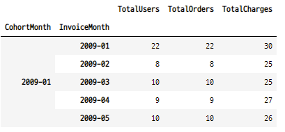

#### 5-2. 그룹화 객체로 통계값 계산하는 방법 2
- groupby 할 컬럼으로 그룹화 객체를 만든다.
- 그룹화 객체를 .agg({}) 함수를 사용하여 나머지 컬럼들에 대한 통계값 계산을 실행한다.

```python
grouped = df2.groupby(["CohortMonth", "InvoiceMonth"])
cohorts_df_2 = grouped.agg({"UserId" : pd.Series.nunique,
                          "OrderId" : pd.Series.nunique,
                          "TotalCharges" : np.sum})

cohorts_df_2.rename(columns={"UserId" : "TotalUsers",
                            "OrderId" : "TotalOrders"}, inplace=True)			  
cohorts_df_2.head()
```

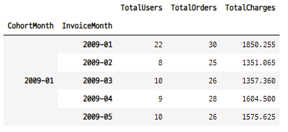

### 6. cohortperiod
- 코호트 그룹
- 첫 주문월과 이후 주문한 월의 차이 : 단위기간
- 함수를 만들어 계산
    - 그룹바이한 데이터에서 cohortmonth의 값의 길이만큼 연속 정수를 생성한다.
    - 1을 더해주면, 단위기간이 1부터 시작하게 된다.
- 
```python
def cohort_period(df) : 
    df["CohortPeriod"] = np.arange(len(df)) + 1
    return df

cohorts_df = cohorts_df_2.groupby(level=0).apply(cohort_period)
cohorts_df    
```

### 7. 데이터 비교
- cohortmonth, cohortperiod의 값이 잘 만들어졌는지 확이하기 위하여  원본데이터와 비교
- 원본 데이터에서 cohortmonth와 invoicemonth 가 2009-01 인 데이터 불러오기

```python
x = df2[(df2["CohortMonth"] == "2009-01") & (df2["InvoiceMonth"] == "2009-01")]
x
```

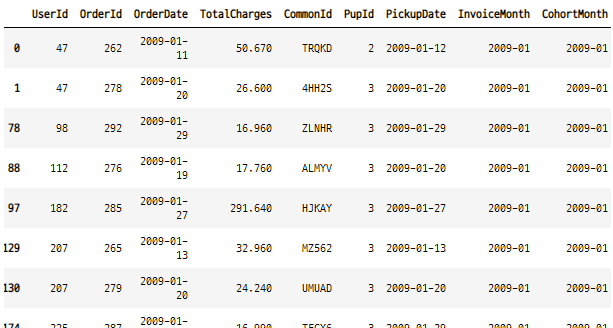

- cohortmonth와 invoicemonth로 groupby 한 통계값 테이블에서 2009-01 데이터 불러오기
```python
y = cohorts_df.loc[("2009-01", "2009-01")]
y

>>>

TotalUsers        22.000
TotalOrders       30.000
TotalCharges    1850.255
CohortPeriod       1.000
Name: (2009-01, 2009-01), dtype: float64
```

- x, y의 값 비교
- assert(비교문) : 아무것도 출려되지 않으면 True라는 의미이다.

```python
assert(x["UserId"].nunique() == y["TotalUsers"])
assert(x["OrderId"].nunique() == y["TotalOrders"])
assert(x["TotalCharges"].sum().round(2) == y["TotalCharges"].round(2))
```

### 8. cohort table

```python
cohorts_df.reset_index(inplace=True)
cohorts_df.set_index(["CohortMonth", "CohortPeriod"], inplace=True)
cohorts_df
```

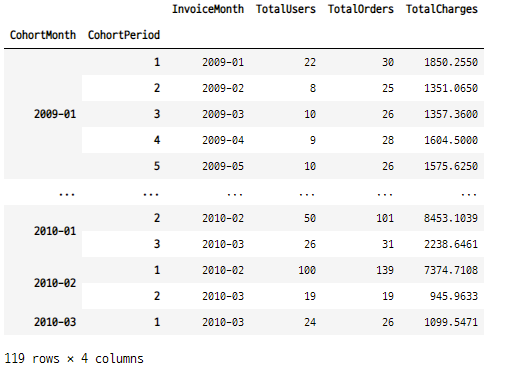

#### 8-1. cohort size
- 코호트 그룹의 첫 단위기간의 값
- retention을 구하기 위한 기준값
- cohort_matrix를 만들고 첫번째 열을 선택해도 된다.

```python
cohort_group_size = cohorts_df["TotalUsers"].groupby(level=0).first()
cohort_group_size

>>>

CohortMonth
2009-01     22
2009-02     15
2009-03     13
2009-04     39
2009-05     50
2009-06     32
2009-07     50
2009-08     31
2009-09     37
2009-10     54
2009-11    130
2009-12     65
2010-01     95
2010-02    100
2010-03     24
Name: TotalUsers, dtype: int64
```

#### 8-2. cohort table
```python
cohorts_df["TotalUsers"].unstack(1)
```

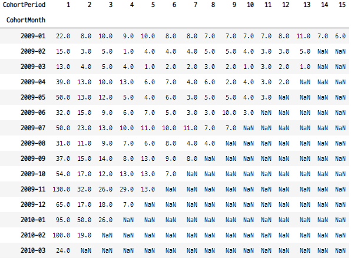


### 9. Retention Matrix
- TotalUsers : 방문한 고객의 총합으로 retention 확인
    - 다른 컬럼으로 retention을 확인해도 된다.

```python
ret_matrix = cohorts_df["TotalUsers"].unstack(0).divide(cohort_group_size, axis=1)
ret_matrix
```

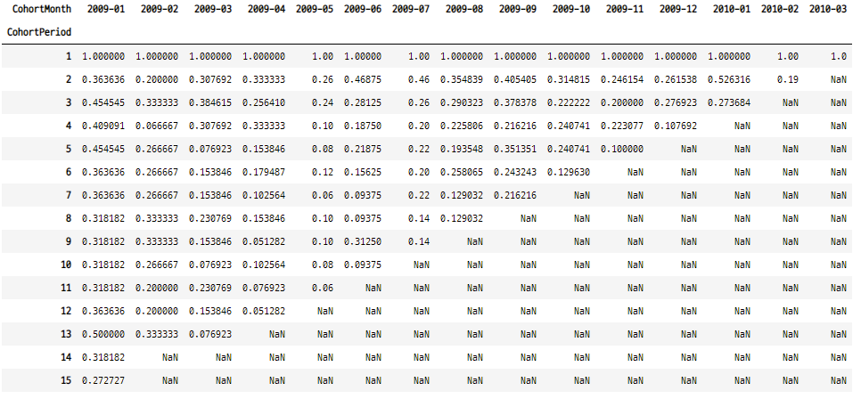


#### 8-3. 2009-06, 2009-07, 2009-08 의 고객 재방문율 변화 그래프로 확인하기
- 06, 07월 그룹이 처음 방문한 수는 많았지만 코호트 기간이 지날 수록 재방문율이 줄어든다.
- 08월 그룹은 처음 방문한 수는 적었지만 코호트 기간의 마지막에 다른 그룹보다 더 재방문율이 더 컸다.

```python
%matplotlib inline

ret_matrix[["2009-06", "2009-07", "2009-08"]].plot(figsize=(10, 5))
plt.title("cohorts : user retention")
plt.xticks(np.arange(1, 12.1, 1))
plt.xlim(1, 12)
plt.ylabel("% of cohort purchasing")

plt.show() ;
```

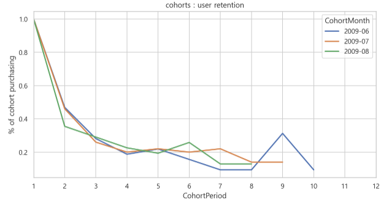


### 9. heatmap

```python
sns.set(style="white")

plt.figure(figsize=(10, 8))
sns.heatmap(ret_matrix.T, mask=ret_matrix.T.isnull(), annot=True, fmt=".0%")
plt.title("cohorts : user retention")

plt.show() ;
```

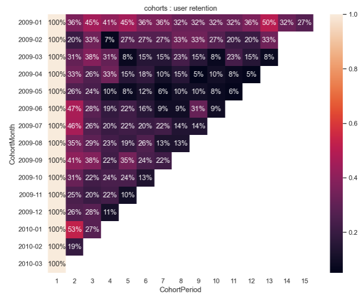


#### 9-1. 최근 발생한 매출의 회원들의 첫 구매일 분포도
- 구매금액의 리텐션
- 각 행의 가장 마지막 값을 대각선으로 하는 구간이 2010-03의 전체 구매 금액이다.
- 즉 각 코호트 집단별로 가장 최근에 구매한 분포를 비교 할 수 있다. 
- 2009-07월에 방문한 집단은 가장 최근 401을 구매했다. 
- 2009-06월에 방문한 집단은 가장 최근 162 만큼 구매했다. 
- 이를 통해서 2009-07월 방문집단에서 더 많은 리텐션이 이어지고 있음을 알 수 있다. 

```python
sns.set(style="white")

plt.figure(figsize=(9, 7))
sns.heatmap(cohorts_df["TotalCharges"].unstack(0).T.fillna(0).astype("int"),
           mask=ret_matrix.T.isnull(), annot=True, fmt="0")
plt.title("cohorts : totalcharges")

plt.show() ;
```

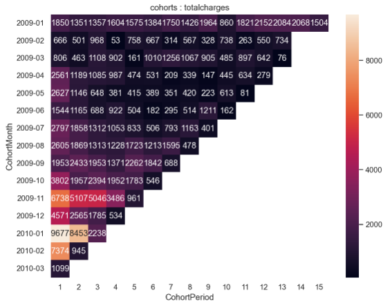

### 참고 사이트
- https://alex-blog.tistory.com/entry/pythoncohort

