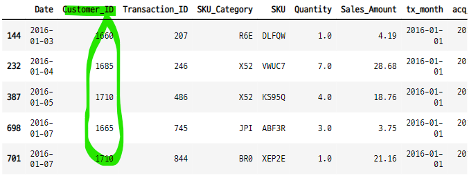

# 코호트 4

## cohort analysis with python
- https://www.activestate.com/blog/cohort-analysis-with-python/
- 데이터 분석은 우리에게 어떤 트랜드에 대한 통찰을 준다.
- 많은 경우 데스크톱 브라우저보다 스마트폰을 사용하는 방문자나 어떤 구매금액과 같은 그룹과 연관지으면 더 가치가 생긴다.
- 특정한 시간 범위에서의 공통된 특성을 공유하는 그룹 혹은 코호트 별로 데이터를 분석하면 더 효과적이다.

### process
- install the runtime environment
- import and clean the dataset
- assign cohorts
- calcuate retention reates
- segment data by quantity and revenue
- forecast the corhot data

## python

### 1. 데이터 임포트

```python
url = "https://raw.githubusercontent.com/nickmancol/python-cohorts/main/data/scanner_data.csv"

df = pd.read_csv(url)
```

### 2. 데이터 확인
- 13만개의 데이터 
- null data 없음
- 8개의 컬럼

```python
df.info()
```


```python
df.describe()
```


#### 주문기간의 처음과 끝
- 2016-02-01
- 2016-12-31

```python
df["Date"].min(), df["Date"].max()

>>>

('01/02/2016', '31/12/2016')
```

### 3. 데이터 전처리, 클리닝
- 원본 df
- copy dff

```python
df2 = df.copy()
df2.columns

>>>

Index(['Unnamed: 0', 'Date', 'Customer_ID', 'Transaction_ID', 'SKU_Category',
       'SKU', 'Quantity', 'Sales_Amount'],
      dtype='object')
```

#### 불필요한 컬럼 제거

```python
df2.drop(["Unnamed: 0"], axis=1, inplace=True)
df2.head(3)
```


#### 날짜 형식 변환
- to_datetime(컬럼, format=현재날짜형식) : 년-월-일 형식으로 변환해 준다.

```python
df2["Date"] = pd.to_datetime(df2["Date"], format="%d/%m/%Y")
df2.head(3)
```


#### 다른 방법으로 날짜 형식 변환
- dt.strftime("")

```python
df2["Date"].dt.strftime("%Y-%m-%d")

>>>

0         2016-01-02
1         2016-01-02
2         2016-01-02
3         2016-01-02
4         2016-01-02
             ...
131701    2016-07-04
131702    2016-07-04
131703    2016-07-04
131704    2016-07-04
131705    2016-07-04
Name: Date, Length: 131706, dtype: object
```

- apply(lambda x : x.strftime("))

```python
df2["Date"].apply(lambda x : x.strftime("%Y-%m-%d"))

>>>

0         2016-01-02
1         2016-01-02
2         2016-01-02
3         2016-01-02
4         2016-01-02
             ...
131701    2016-07-04
131702    2016-07-04
131703    2016-07-04
131704    2016-07-04
131705    2016-07-04
Name: Date, Length: 131706, dtype: object
```

- dt.to_period("d") :d, M, Y 등 사용가능

```python
df2["Date"].dt.to_period("d")

>>>

0         2016-01-02
1         2016-01-02
2         2016-01-02
3         2016-01-02
4         2016-01-02
             ...
131701    2016-07-04
131702    2016-07-04
131703    2016-07-04
131704    2016-07-04
131705    2016-07-04
Name: Date, Length: 131706, dtype: period[D]
```

#### 중복 데이터 확인
- df.duplicated([컬럼1, 컬럼2, ...], keep=first) : 앞, 뒤 행의 중복 여부를 확인하여 어떤 것을 남길 것인지 T, F로 반환해 준다. True이면 삭제, False면 남겨둔다.
    - keep=first : 앞 False, 뒤 True : 앞을 남겨두고, 뒤를 삭제한다. 
    - keep=last : 앞 True, 뒤 False : 앞을 삭제하고 뒤를 남겨둔다.
    - keep=False : 중복인 경우 앞, 뒤 모두 True를 반환 : 둘다 삭제한다.
- df.drop_duplicated([컬럼1, 컬럼2, ...], keep=first) : keep에 따라서 unique한 1개의 key값만 남기고 나머지 중복은 제거 하여 데이터 프레임을 반환한다.

#### 날짜와 고객id로 중복 확인
- 특정날짜에 한 고객이 주문한 횟수
- 2022-05-05 에 A 고객이 10건 주문했다면 True가 9개, False가 1개로 반환 된다. 
    - T, F 위치는 keep인수값에 따라 달라짐.

- 현재 데이터의 길이

```python
origin_len = len(df2)
origin_len

>>>

131706
```

- 중복데이터를 데이터의 길이

```python
dupli_len = df2.duplicated(["Date", "Customer_ID"]).sum()
dupli_len

>>>

68979
```

- 중복 데이터 제거 후 데이터 길이

```python
n_order_one_customer = origin_len - dupli_len
n_order_one_customer

>>>

62727
```

### 4. 중복 데이터를 그룹화
- 특정날짜에 구매한 고객별로 그룹화
    - 2022-05-05에 A가 10번 구매한 경우 이것을 groupby하고, 컬럼별로 연산 한다.
- agg({}) 함수를 사용하여 그룹화의 연산을 각 컬럼별로 적용할 수 있다.    
- drop_duplicated() 함수사용하지 않고 groupby로 중복 데이터를 사용

```python
df22 = pd.DataFrame(df2.groupby(["Date", "Customer_ID"]) \
                   .agg({"Transaction_ID" : max,
                        "SKU_Category" : max,
                        "SKU" : max,
                        "Quantity" : sum,
                        "Sales_Amount" : sum})).reset_index()

print("날짜별 고객별 주문건으로 통합한 후 데이터의 길이 : ", len(df2))
print("gorupby 한 후의 길이 = duplicated 를 제거한 길이 비교 : ", len(df22) == n_order_one_customer)

>>>

날짜별 고객별 주문건으로 통합한 후 데이터의 길이 :  131706
gorupby 한 후의 길이 = duplicated 를 제거한 길이 비교 :  True
```

#### 주문금액이 가장 큰 데이터 확인
- 어떤 고객이 주문 했을까?

```python
# 가장 큰 주문금액의 인덱스
df22["Sales_Amount"].argmax()

>>>

52993

# 가장 큰 주문 금액
df22["Sales_Amount"].max()

>>>

707.73
```

#### 주문금액이 가장 큰 주문건

```python
top_order = df22.iloc[df22["Sales_Amount"].argmax()]
top_order
```


#### 고객아이디 20906의 주문 현황
- 2016-06-01, 07-17, 11-09 3날짜에 주문을 했다.
- 11-09 주문한 금액이 가장 크다

```python
df22[df22["Customer_ID"] == top_order["Customer_ID"]]
```


- 날짜별 모든 주문건


### 5. tx_month, acq_month
- 시간기준으로 분석할 수 있는 그룹으로 분할한다.
- 각 거래에 대한 cohort 할당
- 두개의 컬럼 생성
    - tx_month : 주문 날짜 : order_month
    - acq_month : 고객 별 최초 주문 날짜 : cohort_month

#### tx_month
- 주문한 날짜의 월을 만들고, 날을 1일로 만든다.
    - 2016-02-08 -> 2016-02-01
    - 2016-02-15 -> 2016-02-01
- 고객별 tx_month에서 최소값이 코호트 그룹의 기준이 된다.
    - 2016-03-01, 2016-05-01, 2016-06-01 -> 2016-03-01 이 최소값이 된다.
    - acq_month
- 날짜를 1일로 통일하고 "월"을 비교하기위한 것 같다.
- 구매 날짜가 다 다르다면 최소값이 달라지기 때문
- 월별로 코호트 그룹을 생성하는 것과 같은 의미이다.

#### acq_month
- 고객별 tx_month의 최소값
- 즉 첫 주문한 달의 1일 값
    - A고객이 2022-05-24, 2022-06-01 주문 했다면
    - tx_month는 2022-05-01, 2022-06-01 이고,
    - acq_month는 2022-05-01이 된다.
- 일자를 통일해서 월별로 코호트 그룹화한다.
- cohort_month와 같은 의미이다.

#### 주문한 월 데이터 생성
- tx_month
- 주문한 날짜 데이터에서 년, 월 데이터를 가져온다. 일은 1일로 통일해준다. 
    - 일은 삭제해도 됨
- dtype : object

```python
df22["tx_month"] = df22["Date"].apply(lambda x : dt.date(x.year, x.month, 1))
df22.head(3)
```


#### dt.date(x.year, x.month, x.day) test
- dt.date() 함수 테스트

```python
test = df22.iloc[1]["Date"]
test

>>>

Timestamp('2016-01-02 00:00:00')
```

- 년, 월, 일 데이터 가져오기

```python
dt.date(test.year, test.month, test.day)

>>>

datetime.date(2016, 1, 2)
```

- 년, 월, 일의 값을 고정 시킬 수 있다.

```python
dt.date(test.year, 10, test.day)

>>>

datetime.date(2016, 10, 2)
```

- 년월일 데이터를 가져오고 날짜 형식을 바꿀 수 있다.

```python
dt.date(test.year, 10, test.day).strftime("%Y-%m-%d-%a-%b")

>>>

'2016-10-02-Sun-Oct'
```

#### cohort 그룹 생성
- tx_month의 최소값
- 첫 주문을 한 달의 첫 날

```python
df22["acq_month"] = df22.groupby("Customer_ID")["tx_month"].transform("min")
df22.head(3)
```


#### tx_month와 acq_month의 차이
- tx_month와 acq_month의 차이가 cohort period와 같은 의미이다.
- 주문건별 서로다른 월과 최초 구매한 월의 차이
- 1월에 첫 주문하고 2월에 다음 주문을 했다는 의미 즉 retention이 발생했다는 것

### 5-1. 10회 주문한 고객의 주문 현황 분석
- 14845 고객의 주문 현황
- 총 몇개를 주문했나?
- 총 주문 금액은 얼마인가?
- 어떤 상품을 많이 구매했는가?

#### 10회 주문한 고객

```python
test = df22["Customer_ID"].value_counts() == 10
test.sort_values(ascending=False)[:10]

>>>

10610    True
6764     True
14845    True
10137    True
18920    True
15911    True
18536    True
15512    True
17544    True
17815    True
```

#### 이 중 14845 고객의 주문 현황
- 2016-06-03 에 처음 주문한 이후 12월까지 꾸준히 재구매 했다.

```python
customer_14845 = df22.loc[df22["Customer_ID"] == 14845]
customer_14845
```


#### 14845 고객이 주문한 수량, 구매 금액

```python
customer_14845.groupby("Customer_ID").agg({"Quantity" : sum, "Sales_Amount" : sum})
```


#### 많이 주문한 품목은?
- origin_df 에서 조회해야 한다.
   - 주문일 당 하나의 주문건만 남겼기 때문

```python
customer_14845["SKU_Category"].value_counts()

>>> print

J4R    3
R6E    1
JPI    1
LPF    1
LSD    1
7C6    1
U5F    1
FEW    1
Name: SKU_Category, dtype: int64
```
#### 10번 서로다른 날에 주문한 고객 10명의 주문현황
- 주문건수가 10번이 아니라, 10일
- 여러개의 인덱스, 항목 등을 동시에 필터링하는 방법
- df["컬럼"].isin([a, b, c]) : a, b, c를 만족하는 데이터 필터링
- ~df["컬럼"].isin([a, b, c]) : a, b, c를 제외한 데이터 필터링, 앞에 ~ 표시 붙이기 

```python
n_order_10 = test[:10].index
n_order_10

>>> print

Int64Index([1660, 1710, 1665, 1685, 17471, 15685, 9048, 15491, 2186, 1694], dtype='int64')
```

```python
order_10days = df22[df22["Customer_ID"].isin(n_order_10)]
order_10days.head()
```


#### 서로다른 10일 간 주문한 고객 10명의 주문현황 요약
- 가장 구매금액이 큰 고객은 17471

```python
order_10days_tabel = order_10days.groupby("Customer_ID") \
.agg({"Quantity" : sum, "Sales_Amount" : sum, "Date" : pd.Series.nunique}) \
.sort_values("Sales_Amount", ascending=False)

order_10days_tabel
```


#### 고객별 구매 수량을 그래프로 확인
- 고객 그룹의 아이디를 리스트에 담는다.

```python
idx_lst = [str(a) for a in order_10days_tabel.index]
idx_lst

>>> print

['17471',
 '1665',
 '15685',
 '1660',
 '1685',
 '1710',
 '1694',
 '2186',
 '9048',
 '15491']
```

- ploting

```python
plt.figure(figsize=(8, 6))
plt.bar(idx_lst,  order_10days_tabel["Quantity"], width=0.7)
plt.xlabel("# of customerID")
plt.ylabel("Quantity")
plt.show() ; 
```


#### 서로 다른 10일간 주문한 고객들이 가장 많이 산 제품을 그래프로 확인
- 많이 구매한 상품 카테고리 조회

```python
top_cate = order_10days["SKU_Category"].value_counts()[:20]
top_cate

>>> print

XG4    67
R6E    44
N8U    40
P42    31
JPI    28
Q4N    23
H15    22
Z4O    17
X52    17
0H2    17
DJI    16
DGB    14
TW8    14
H1H    13
N5F    12
SIM    12
SFC    11
2ML    10
TVL     9
FEW     9
Name: SKU_Category, dtype: int64
```

- ploting

```python
plt.figure(figsize=(17, 9))
sns.barplot(x=top_cate.values, y=top_cate.index, palette="tab20c_r")
sns.set_context("talk")
plt.xticks(np.arange(0, 66, 5))
plt.xlabel("Amount", y=1.05)
plt.ylabel("Product")
plt.title("Most selling 20 products", fontsize=20, y=1.05)
plt.show() ;
```


### 6. cohort index
- cohort period 와 같다.
- tx_month와 acq_month 의 차이 + 1
    - 0부터 시작하지 않고 1부터 시작하도록 한다. 
- 즉 고객별 처음 구매한 월로부터 각각의 구매 시점의 월과의 차이
    - 처음 구매월이 2016-03 인경우 어떤 구매시점이 2016-05라면 차이는 3이된다.
    - 이 값이 리텐션 기간의 기준이 된다.

#### 시계열 데이터 연산 함수 만들기

```python
def diff_month(x) :
    d1 = x["tx_month"]
    d2 = x["acq_month"]

    return ((d1.year - d2.year) * 12 + (d1.month - d2.month))  + 1
```

#### cohort idx 생성
- cohort period

```python
df22["cohort_idx"] = df22.apply(lambda x : diff_month(x), axis=1)
df22.head()
```


### 6-1. 시계열의 연산에서 attrgetter 메서드를 사용하려면
- 최초 구매일과 다음 구매일의 차이를 계산하기 위한 방법 중 하나.

#### 시계열 데이터 변환 시
- dt.to_period()를 사용하면 자료형이 period[]가 된다.
   - 같은 period[] 타입 끼리 연산을 한 후 attrgetter("n")을 사용하여 차이값을 반환할 수 있다.
- dt.strftime()을 사용하면 자료형이 object(문자열)가 된다.
   - 이 경우는 직접 연산을 할 수 없다.
   - attrgetter()를 사용할 수 없다.

### 7. retention rates
- get_cohort_matrix() 함수를 만들고, 절대값과 비율을 반환한다.
    - cd : 첫 구매월별 코호트 기간별(다음 구매일) 고객의 수를 계산
       - 2016-01-01에 처음 구매한 사람 중 다음 구매일이 1달후 인 고객, 2달 후인 고객의 갯수
       - cohort_period의 값은 +1 이 된 값이므로, 1이면 첫달의 구매한 것, 2이면 한달 후에 재구매 한 것으로 볼 수 있다.
    - cc : pivot_table : 처음 구매일로부터 다음 구매월별 고객 수 피봇테이블
    - cs : 처음 구매한 달의 구매 고객 수
    - retention : 월별 코호트당 비율
       - 처음 구매한 월의 데이터를 행 기준으로 나누어준다. 

### 7-1. 코호트 매트릭스를 반환하는 함수
- 코호트 매트릭스를 피벗테이블 형태로 반환해 준다.
- 리텐션 값을 계산할 기준이 되는 컬럼을 함수의 파라미터 값으로 변경하여 조회할 수 있다.
- 그룹연산 값을 변경하여 조회할 수 있다.

```python
def get_cohort_matrix(data, var="Customer_ID", func=pd.Series.nunique) :
    cd = data.groupby(["acq_month", "cohort_idx"])[var].apply(func).reset_index()
    cc = cd.pivot_table(index="acq_month",
                       columns="cohort_idx",
                       values=var)
    cs = cc.iloc[:, 0]
    retention = cc.divide(cs, axis=0)
    retention = retention.round(3) * 100

    return cc, retention
```

### 7-2. 고객의 주문건수에 대한 코호트 분석
- customerid 별 주문건수
- cc 는 고객별 첫 구매월을 기준으로 코호트 기간 별 주문건수를 카운팅한 값을 조회한 것과 같다.
- 2016-01월에 처음 구매한 고객은 다음 구매월인 2월에 주문건수가 줄었다.
    - 3396 -> 1306
    - 즉 1월에 처음 구매한 사람들의 재구매율이 낮다.

```python
cc, retention = get_cohort_matrix(df22)
cc
```


- retention : 기준 데이터를 각 컬럼별로 나누어 준 값
    - 즉 어떤 기준으로부터 얼마나 변화했는지를 의미한다.
    - 재구매율, 재방문율 등으로 해석할 수 있다.
    - **특정 기간의 그룹이 다음 행동을 어떻게 하는지 패턴을 알 수 있다**

```python
retention
```


### 8. 히트맵 함수
- 히트맵 설정 함수

```python
def heatmap(data, row_labels, col_labels, ax=None,
            cbar_kw={}, cbarlabel="", **kwargs) :

    if not ax :
        ax = plt.gca()

    im = ax.imshow(data, **kwargs)

    cbar = ax.figure.colorbar(im, ax=ax, **cbar_kw)
    cbar.ax.set_ylabel(cbarlabel, rotation=-90, va="bottom")

    ax.set_xticks(np.arange(data.shape[1]))
    ax.set_yticks(np.arange(data.shape[0]))

    ax.set_xticklabels(col_labels)
    ax.set_yticklabels(row_labels)

    ax.tick_params(top=True, bottom=False, labeltop=True, labelbottom=False)

    plt.setp(ax.get_xticklabels(), rotation=-30, ha="right", rotation_mode="anchor")

    ax.spines[:].set_visible(False)

    #ax.set_xticks(np.arange(data.shape[1] + 1) - .5, minor=True)
    #ax.set_yticks(np.arange(data.shape[0] + 1) - .5, minor=True)

    ax.grid(which="minor", color="w", linestyle="", linewidth=2)
    ax.tick_params(which="minor", bottom=False, left=False)
    ax.grid(False)

    return im, cbar
```

- 히트맵의 문자를 설정하는 함수

```python
def annotate_heatmap(im, data=None, valfmt="{x:.2f}", textcolors=("black", "white"),
                    threshold=None, **textkw) :

    if not isinstance(data, (list, np.ndarray)) :
        data = im.get_array()

    if threshold is not None :
        threshold = im.norm(threshold)
    else :
        threshold = im.norm(data.max()) / 2

    kw = dict(horizontalalignment="center", verticalalignment="center")
    kw.update(textkw)

    if isinstance(valfmt, str) :
        valfmt = matplotlib.ticker.StrMethodFormatter(valfmt)

    texts = []
    for i in range(data.shape[0]) :
        for j in range(data.shape[1]) :
            kw.update(color=textcolors[int(im.norm(data[i, j]) > threshold)])
            text = im.axes.text(j, i, valfmt(data[i, j], None), **kw)
            texts.append(text)

    return texts
```

### 8-1. 히트맵으로 나타내기

```python
fig, ax = plt.subplots(figsize=(9, 7))
im, cbar = heatmap(retention, retention.index, retention.columns,
                  ax=ax, cmap="YlGn", cbarlabel="% Retention")
texts = annotate_heatmap(im, valfmt="{x:.2f}")
fig.tight_layout()
plt.show() ;
```


### 8-2. 주문수량에 대한 코호트 분석
- 코호트 기간 별 평균 주문수량
- retention matrix

```python
cc_q, retention_q = get_cohort_matrix(df22, var="Quantity", func=pd.Series.mean)
retention_q
```


- heatmap

```python
fig, ax = plt.subplots(figsize=(9, 7))
im, cbar = heatmap(cc_q, cc_q.index, cc_q.columns, ax=ax,
                  cmap="Blues", cbarlabel="AVG Items")
texts = annotate_heatmap(im, valfmt="{x:.2f}")
fig.tight_layout()
plt.show() ;
```


### 8-3. 판매금액에 대한 코호트 분석
- retention matrix

```python
cc_sa, ret_sa = get_cohort_matrix(df22, var="Sales_Amount",
                                 func=pd.Series.median)

ret_sa				 
```


- heatmap

```python
fit, ax = plt.subplots(figsize=(9, 7))
im, cbar = heatmap(cc_sa, cc_sa.index, cc_sa.columns, ax=ax,
                  cmap="PRGn", cbarlabel="Median Sales Amount")
text = annotate_heatmap(im, valfmt="{x:.2f}")
fig.tight_layout()
plt.show() ;
```


