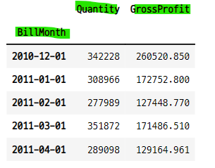
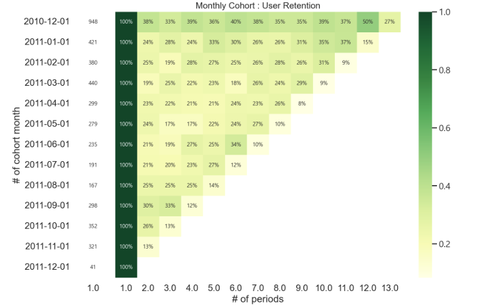
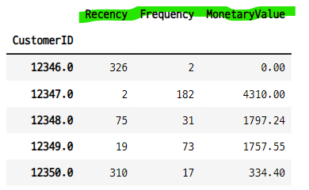
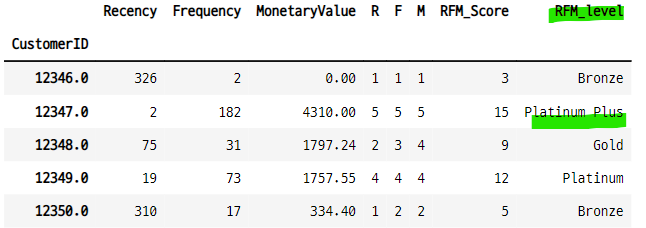
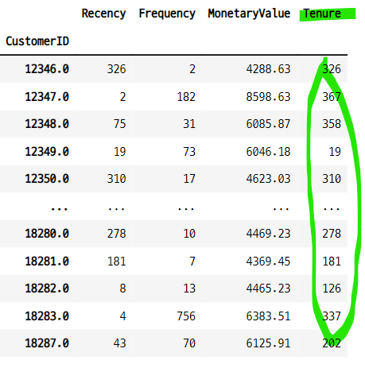

# 코호트 5

## cohort analysis and customer segmentation with python
- https://github.com/kennedykwangari/Cohort-Analysis-and-Customer-Segmentation-with-Python/blob/master/Cohort_Analysis.ipynb

### contents
- import libraries and read dataset
- exploratory data analysis
- cohort analysis
    - what is cohort analysis?
    - cohort analysis with pyhon
- RFM analysis for customer segmentation
    - what is RFM analysis
    - RFM analysis with python
- k-means clustering

### cohort analysis
- 코호트는 데이터 세트에서 분석을 위해 관련 그룹으로 나누는 행동 분석의 하위 집합과 같다.
- 코호트는 **정의된 시간 범위** 내에서 공통적인 특성 또는 경험을 공유한다. 
    - 특정한 날에 가입한 유저
    - 특정한 날에 홈페이지에서 물건을 구매한 유저
    - 특정한 제품을 구매한 유저
    - 특정한 채널을 통해 유입된 유저
    - 특정한 프로모션, 마케팅 상품을 적용받은 유저들 등....
- 코호트는 고객의 life_cycle 전반에 걸친 패턴을 명확하게 할 수 있다.
- 이러한 시간 패턴을 통해서 특정 코호트에 맞게 서비스를 조정하고 변화시킬 수 있다.
- 코호트 분석과 코호트 연구 cohort study가 관련 있을 수 있지만, 다르다.

### 1. 라이브러리 임포트 
- import libraries and read dataset
- 새로 설치하는 모듈이나 패키지가 있는지 확인하고, 반드시 어떤 패키지들이 함꼐 설치되는지, 기존에 설치된 다른 라이브러리하고는 충돌이 없는지 확인 할 것!!!

- os 패키지로 현재 디렉토리의 파일 검색

```python
import numpy as np
import pandas as pd
import matplotlib.pyplot as plt
import datetime as dt
import seaborn as sns
import os

print(os.listdir("./"))
```

### 2. 데이터 임포트

```python
!ls ../../all_data/cohort_data

>>> print

online_retail.xlsx
relay-foods.xlsx
```

- 엑셀 파일 임포트
    - **sheet_name 인수로 어떤 시트의 데이터를 불러올지 설정할 수 있다.**

```python
df = pd.read_excel("../../all_data/cohort_data/online_retail.xlsx",
                  sheet_name="Year 2010-2011")
df.head(3)
```


### 3. 데이터 확인

```python
df.info()

>>> print

<class 'pandas.core.frame.DataFrame'>
RangeIndex: 541910 entries, 0 to 541909
Data columns (total 8 columns):
 #   Column       Non-Null Count   Dtype
---  ------       --------------   -----
 0   Invoice      541910 non-null  object
 1   StockCode    541910 non-null  object
 2   Description  540456 non-null  object
 3   Quantity     541910 non-null  int64
 4   InvoiceDate  541910 non-null  datetime64[ns]
 5   Price        541910 non-null  float64
 6   Customer ID  406830 non-null  float64
 7   Country      541910 non-null  object
dtypes: datetime64[ns](1), float64(2), int64(1), object(4)
memory usage: 33.1+ MB
```

#### 주문수량과 가격의 최소값이 음수이다.
- 반품 된 주문수량이 포함 된 것

```python
df.describe()
```


#### 분석용 데이터 카피

```python
dff = df.copy()
dff.head()
```


### 4. 월별 판매금액 현황 그래프
- BillMonth : 주문날짜를 년-월-1일 로 바꾼 데이터
   - 주문날짜를 월 단위로 통일 시켜주기 위한 방법 
   - OrderMonth
   - tx_month

- dt.datetime() 을 사용하여 새로운 시계열 데이터를 생성해 준다.

```python
def monthly(x) :
    return dt.datetime(x.year, x.month, 1)

dff["BillMonth"] = dff["InvoiceDate"].apply(monthly)
dff.head()    
```


#### 4-1. 컬럼명 변경
- 공백 제거

```python
dff.rename(columns={"Customer ID" : "CustomerID"}, inplace=True)
dff.columns

>>> print

Index(['Invoice', 'StockCode', 'Description', 'Quantity', 'InvoiceDate',
       'Price', 'CustomerID', 'Country', 'BillMonth'],
      dtype='object')
```

#### 4-2. 그래프를 그리기위한 데이터 전처리
- 새로 만든 BillMonth 컬럼을 기준으로 그룹화하여 주문수량과 주문금액의 합 계산
    - 고객 ID 컬럼 제외
    - 다른 컬럼은 카테고리 데이터를 갖고 있으므로 그룹화에서 제외됨

```python
dff_sum = dff.groupby("BillMonth").sum().drop("CustomerID", axis=1)
dff_sum = dff_sum.rename(columns={"Price" : "GrossProfit"})
dff_sum.head()
```
    

#### 4-3. 월별 요약 데이터를 그래프로 나타내기
- sns.lineplot() 또는 plt.plot() 명령 사용 가능
- 9월~11월 사이에 주문 금액 증가율이 가장 높다.
- 2월 주문 금액이 가장 작다.

```python
plt.figure(figsize=(11, 7))
sns.lineplot(x=dff_sum.index, y=dff_sum["GrossProfit"])
plt.title("Monthly : GrossProfit", y=1.05, fontsize=16)
plt.show() ;
```


- 주문 수량 그래프
    - 9~11월 사이에 주문 수량이 가장 높다.
    - 1~2월 사이에 주문 수량이 가장 낮다.
    - 주문 금액 그래프와 유사한 측면이 있다.

```python
plt.figure(figsize=(11, 7))
plt.plot(dff_sum["Quantity"])
plt.xlabel("BillMonth")
plt.ylabel("Quantity")
plt.show() ;
```


### 5. 많이 팔린 품목 그래프
- 가장 많이 팔린 품목 상위 20개의 그래프

```python
most_sell_p = dff["Description"].value_counts()[:20]

plt.figure(figsize=(13, 8))
sns.barplot(x=most_sell_p.values, y=most_sell_p.index, palette="tab20c_r")
sns.set_context("talk")
plt.xticks(np.arange(0, 2401, 100), rotation=-20)
plt.xlabel("Amount")
plt.ylabel("Product")
plt.title("Most Selling 20 Product")

plt.show() ;
```


### 6. CohortMonth 생성
- 고객별 주문 날짜 중 최초 주문한 날짜를 의미한다.
- 고객 아이디를 기준으로 그룹화하고, 주문한 날짜 중에서 최소 날짜를 찾는다.
- 즉 a 고객이 여러달동안 주문했다면, 여기에서 가장 작은 날짜를 반환한다.
    - **이 값이 고객별 공통적인 특성 또는 경험의 기준 시간이 된다.**

```python
g = dff.groupby("CustomerID")["BillMonth"]
dff["CohortMonth"] = g.transform("min")
dff.head(3)
```


### 7. CohortPeriod
- 첫 주문날짜와 각각의 주문날짜간의 차이
    - **코호트 기간**

```python
def get_int(df, column) : 
    year = df[column].dt.year
    month = df[column].dt.month
    
    return year, month

billyear, billmonth = get_int(dff, "BillMonth")
cohortyear, cohortmonth = get_int(dff, "CohortMonth")    
```

#### 7-1. 주문 월과 코호트 월이 같으면 1로 표시
- 코호트 기간은 1부터 시작
- 개별 주문 일자와 첫 주문 일자의 차이를 구한다.

```python
diffYear = billyear - cohortyear
diffMonth = billmonth - cohortmonth

dff["CohortPeriod"] = diffYear * 12 + diffMonth + 1
dff.head()
```


### cohort month의 타입변경
- cohort month의 dtype 변경
    - datetime64[ns] --> object

```python
dff["CohortMonth"] = dff["CohortMonth"].apply(dt.datetime.date)
dff.info()

>>> print

<class 'pandas.core.frame.DataFrame'>
RangeIndex: 541910 entries, 0 to 541909
Data columns (total 11 columns):
 #   Column        Non-Null Count   Dtype
---  ------        --------------   -----
 0   Invoice       541910 non-null  object
 1   StockCode     541910 non-null  object
 2   Description   540456 non-null  object
 3   Quantity      541910 non-null  int64
 4   InvoiceDate   541910 non-null  datetime64[ns]
 5   Price         541910 non-null  float64
 6   CustomerID    406830 non-null  float64
 7   Country       541910 non-null  object
 8   BillMonth     541910 non-null  datetime64[ns]
 9   CohortMonth   541910 non-null  object
 10  CohortPeriod  406830 non-null  float64
dtypes: datetime64[ns](2), float64(3), int64(1), object(5)
memory usage: 45.5+ MB
```

### 8. cohort matrix
- pd.Series.nunique() : groupby 한 후 고객아이디 컬럼 값의  유니크한 개수를 세어준다.
- count()를 사용해서 구하려면, groupby를 여러번 해주어야 한다.
    - 첫 구매월이 2010-12-01 로부터 3달 후인 2010-03-01 에 구매한 고객은 317명이다.  
    - 즉 12월에 처음 구매한 경험을 공통으로 갖는 그룹의 구매 패턴을 알 수 있다.

```python
g = dff.groupby(["CohortMonth", "CohortPeriod"])
cohortData = g["CustomerID"].apply(pd.Series.nunique).reset_index()
cohortData.head(10)
```


#### 8-1. 피봇으로 나타내기
- 즉 첫 구매월로부터 1개월 단위로 시간이 경과될 떄마다 얼마나 구매고객의 증감을 알 수 있다.
    - 인덱스가 각각 하나의 그룹과 같다.
    - 열은 1개월 단위의 시간 경과를 의미한다.
    - 따라서 어떤 그룹이 어떤 시점에 얼마만큼 구매했는지 알 수 있다.

```python
cohortCounts = cohortData.pivot(index="CohortMonth", columns="CohortPeriod", values="CustomerID")
cohortCounts
```


### 9. retention matrix
- 리텐션율을 피벗테이블로 나타낸 것
- 첫 구매월의 데이터를 coshortSize에 저장 후 각 컬럼에서 나누어 준다.
    - axis=0 : 각 행의 맨 앞의 값으로 동일 행의 다른 값에서 나누어 주기때문
- 첫 구매월의 데이터를 각 기간의 데이터에서 나누어 준다.
    - 첫 구매월로부터 얼마나 증감했는지 비율을 알 수 있다.

```python
cohortSize = cohortCounts.iloc[:, 0]
retention_matrix = cohortCounts.divide(cohortSize, axis=0)
retention_matrix
```
[!cohort_case_5_13.png](./images/cohort_case_5_13.png)

### 10. heat map
- retention matrix 를 히트맵으로 나타내면 비율의 증감을 쉽게 파악 할 수 있다.
- 히트맵 2개를 하나의 plot에 나타낼 수 있다.
    - 리텐션 비율 값을 나타내는 부분
    - 첫 구매일 나타내는 부분

```python
import matplotlib.colors as mcolors
%matplotlib inline

with sns.axes_style("white") :
    fig, ax = plt.subplots(1, 2, figsize=(12, 8), sharey=True,
                          gridspec_kw={"width_ratios" : [1, 11]})

sns.heatmap(retention_matrix,
           mask=retention_matrix.isnull(),
           annot=True,
           fmt=".0%",
           cmap="YlGn",
           ax=ax[1])

ax[1].set_title("Monthly Cohort : User Retention", fontsize=16)
ax[1].set(xlabel="# of periods", ylabel="")

cohort_size_df = pd.DataFrame(cohortSize)
cohort_size_df = cohort_size_df.rename(columns={0 : "cohort_size"})
white_cmap = mcolors.ListedColormap(["white"])
sns.heatmap(cohort_size_df,
           annot=True,
           cbar=False,
           fmt="g",
           cmap=white_cmap,
           ax=ax[0])
ax[0].set(xlabel="", ylabel="# of cohort month")

fig.tight_layout()
plt.show() ;
```


# RFM analysis
- Recency, Frequency, Money
    - **Recency** : 구매, 방문 등 고객 활동의 신선함. 마지막 주문 이후, 또는 마지막으로 거래된 시간
    - **Frequench** : 고객의 거래 또는 방문 빈도. 총 트랜젝션 수, 트랜젝션/방문 의 평균시간 (?)
    - **Monetary** : 고객의 소비 의도 또는 고객의 구매력. 총 트랜잭션 값 또는 평균 트랜잭션 값
- 주요 고객의 행동을 나타내는 지표
    - frequency(빈도)와 금전적 가치(Money)는 고객의 수명에 영향을 미친다.
    - recency (새로움)는 retention에 영향을 미친다.
- https://clevertap.com/blog/rfm-analysis/

### 1. RFM 계산
- Recency, Frequency, MonetaryValue 계산
- 전체 주문 일자 중 가장 최근의 날짜에서 고객별 가장 최근의 주문일자의 차이
    - 전체 주문 중 최근 날짜 - 고객별 주문 중 최근 날짜
    - 즉 고객별로 얼마나 최근에 주문했는지 비교할 수 있다.

```python
calculating_date = max(dff.InvoiceDate) + dt.timedelta(days=1)
calculating_date

>>> print

Timestamp('2011-12-10 12:50:00')
```

#### 1-1. 주문별 총금액 계산
- 수량 * 가격

```python
dff["TotalSum"] = dff.Quantity * dff.Price
dff.head(3)
```


#### 1-2. 고객아이디별 데이터 정리
- 고객별로 그룹화 후, InvoiceDate, Invoice, TotalSum 을 각각 계산한다.
- **InvoiceDate** : 
    - 고객별 가장 마지막 주문날짜를 전체 주문의 마지막 날짜(가장 최근)에서 뺸다.
    - 즉 이 고객이 얼마나 최근에 주문했는지를 알기 위한 수치와 같다. (=Recency)
    - 전체 주문날짜 중 최근날짜 - 고객별 주문날짜 중 최근날짜
- **12347 고객**
    - 얼마나 최근에 구매했는가? : InvoiceDate가 2이므로 전체 주문 건중에서 최근에 주문한 것으로 알 수 있다.
    - 얼마나 자주 구매했는가? : 최근에 구매했을 뿐만 아니라 주문 건수도 182건으로 많은 편이다.
    - 얼마나 많이 구매했는가? : 총 구매 금액도 4310이므로 높은 편인다.


```python
data = dff.groupby("CustomerID").agg({
    "InvoiceDate" : lambda x : (calculating_date - x.max()).days,
    "Invoice" : "count",
    "TotalSum" : "sum" })

data.head()
```


#### 1-3. 컬럼명 변경
- RFM 분석의 기준인 Recency, Frequency, MonetaryValue로 변경

```python
data.rename(columns={"InvoiceDate" : "Recency",
                    "Invoice" : "Frequency",
                    "TotalSum" : "MonetaryValue"}, inplace=True)
data.head()
```


#### 1-4. 이탈리아에서 제일 많이 구매한 고객의 Recency
- 이탈리아에서 주문한 데이터 확인

```python
italy_invoice = dff[dff.Country=="Italy"]
italy_invoice.head()
```


- 이탈리아에서 주문한 데이터를 고객별로 정리한 후 총구매 금액이 큰 고객 아이디 확인

```python
it_qt = italy_invoice.groupby("CustomerID").agg({"Quantity" : "mean", "TotalSum" : "sum"})
italy_top_customer = it_qt.index[it_qt.TotalSum.argmax()]
italy_top_customer

>>> print

12594.0
```
- 12594 고객의 recency : 38일

```python
## 최근 구매 날짜
dff[dff.CustomerID==italy_top_customer]["InvoiceDate"].max()

>>> print

Timestamp('2011-11-02 12:20:00')

## 전체 데이터에서 가장 최신 날짜와의 차이
calculating_date - (dff[dff.CustomerID==italy_top_customer]["InvoiceDate"].max())

>>> print

Timedelta('38 days 00:30:00')
```

- 12594 고객의 RFM
   - recency : 38
   - frequency : 119
   - monetaryvalue : 3320.22

```python
data[data.index==italy_top_customer]
```


### 2. RFM Score 계산
- R, F, M값을 각각 5 단계 등급으로 나눈 값.
    - pd.qcut() 사용

#### 2-1. 5단계 등급으로 나누기 위한 범위값 설정
- 5, 4, 3, 2, 1

```python
recency_labels = range(5, 0, -1)
recency_labels

>>> print

range(5, 0, -1)
```

- 1, 2, 3, 4, 5

```python
frequency_labels = range(1, 6)
frequency_labels

>>> print

range(1, 6)
```
#### 2-2. Recency 컬럼을 5단계 등급으로 나누기
- Recency 값이 큰 고객은 주문한지 오래 됐으므로 등급을 낮게 한다.
    - 5등급일 수록 높다.
    - range(5, 0, -1) : 5, 4, 3, 2, 1

```python
recency_groups = pd.qcut(data.Recency, q=5, labels=recency_labels)
recency_groups

>>> print

CustomerID
12346.0    1
12347.0    5
12348.0    2
12349.0    4
12350.0    1
          ..
18280.0    1
18281.0    1
18282.0    5
18283.0    5
18287.0    3
Name: Recency, Length: 4372, dtype: category
Categories (5, int64): [5 < 4 < 3 < 2 < 1]
```

#### 2-3. Frequency 컬럼을 5단계로 나누기
- 주문건수가 빈번할 수록 등급이 높다.
    - 5등급이 가장 높다.
    - range(1, 6) : 1, 2, 3, 4, 5

```python
frequency_groups = pd.qcut(data.Frequency, q=5, labels=frequency_labels)
frequency_groups

>>> print

CustomerID
12346.0    1
12347.0    5
12348.0    3
12349.0    4
12350.0    2
          ..
18280.0    1
18281.0    1
18282.0    1
18283.0    5
18287.0    4
Name: Frequency, Length: 4372, dtype: category
Categories (5, int64): [1 < 2 < 3 < 4 < 5]
```

#### 2-6. MmonetaryValue의 값을 5단계 등급으로 나누기
- 총 주문 금액이 높을 수록 등급이 높다. 
    - 5등급이 가장 높다. 

```python
monetary_labels = range(1, 6)
monetary_groups = pd.qcut(data.MonetaryValue, q=5, labels=monetary_labels)
monetary_groups.head()

>>> print

CustomerID
12346.0    1
12347.0    5
12348.0    4
12349.0    4
12350.0    2
Name: MonetaryValue, dtype: category
Categories (5, int64): [1 < 2 < 3 < 4 < 5]
```

#### 2-4. R, F, M 컬럼 생성
- **df.assign(컬럼명=데이터) : 새로 알게 된 방법**

```python
data = data.assign(R=recency_groups.values, F=frequency_groups.values)
data = data.assign(M=monetary_groups)
data.head()
```


#### 2-5. RFM score 생성
- RFM Score : R + F + M
- RFM Score 가 높은 고객은?
    - 가장 최근에 들어온 고객 : Recency
    - 가장 빈번하게 주문한 고객 : Frequency
    - 가장 주문금액이 많은 고객 : MonetaryValue

```python
data["RFM_Score"] = data[["R", "F", "M"]].sum(axis=1)
data.head()
```


### 3. RFM Score 별 고객 등급 만들기
- R+F+M = RFM 값을 기준으로 고객 등급을 만든다.
    - Platinum Plus, Platinum, Gold, Silver, Bronz

```python
def rfm_level(df) : 
    if df["RFM_Score"] >= 14 : 
        return "Platinum Plus"
    elif ((df["RFM_Score"] >= 11) and (df["RFM_Score"] < 14)) : 
        return "Platinum"
    elif ((df["RFM_Score"] >= 8) and (df["RFM_Score"] < 11)) :
        return "Gold"
    elif ((df["RFM_Score"] >= 6) and (df["RFM_Score"] < 8)) :
        return "Silver"
    else : 
        return "Bronze"

data["RFM_level"] = data.apply(rfm_level, axis=1)
data.head()	
```


#### 3-1. 이탈리아에서 가장 주문을 많이 한 고객의 등급은?
- 12594 고객의 RFM 분석

```python
data[data.index==italy_top_customer]
```


#### 3-2. RFM score 등급별 분포
- 등급별 고객 수

```python
data.RFM_level.value_counts()

>>> print

Gold             1106
Platinum          993
Bronze            905
Silver            756
Platinum Plus     612
Name: RFM_level, dtype: int64
```

- 분포도
    - sns.countplot() : 카테고리 데이터의 분포도

```python
plt.figure(figsize=(8, 6))
sns.countplot(data.RFM_level)
plt.title("RFM Level : Count", fontsize=18, y=1.05)
plt.show() ;
```

### 4. 고객 등급별 RFM의 통계값 비교
- 고객 등급별로 그룹화 후 각 R, F, M 의 통계값을 구한다.
- 가장 낮은 등급과 가장 높은 등급을 비교할 수 있다.
    - Bronze 의 Recency 값은 218 이므로 최신으로부터 218일 전에 마지막으로 구매했다.
    - Platinum Plus 등급의 Recency 값은 9.6 이므로 최신으로부터 9일전에 마지막으로 구매했다.
    - 이외에도 각각의 값을 비교하면 Bronze 등급보다 Platinum Plus 등급의 고객들이 최신율, 빈도율, 총금액이 높다.

```python
rfm_level_agg = data.groupby("RFM_level").agg({
    "Recency" : "mean",
    "Frequency" : "mean",
    "MonetaryValue" : ["mean", "count"]
}).round(1)

rfm_level_agg
```


#### 4-1. 각 등급별 고객수
- pd.qcut() 명령으로 구분한 결과
- 이를 토대로 각 등급별 인원수의 갯수를 수정할 수 있다.
    - **또한 각 등급별 인원수를 유지하기 위한 다양한 프로모션을 기획할 수 있다.**

```python
data.RFM_level.value_counts().to_frame()
```


#### 4-2. 컬럼이 2중으로 되어있을 때 정렬하는 방법
- 튜플로 2중 컬럼을 정렬 기준으로 지정해준다.
- 다중인덱스 테이블의 현재 구조

```python
rfm_level_agg.columns

>>> print

MultiIndex([(      'Recency',  'mean'),
            (    'Frequency',  'mean'),
            ('MonetaryValue',  'mean'),
            ('MonetaryValue', 'count')],
           )
```

- 총금액 평균값 기준으로 정렬

```python
rfm_level_agg.sort_values(("MonetaryValue", "mean"), ascending=False)
```


### 5. 데이터 스케일링
- k-means 클러스터링을 위한 데이터 스케일링

#### 5-1. RFM 분포도

```python
data_rfm = data[["Recency", "Frequency", "MonetaryValue"]]

plt.figure(figsize=(17, 20))
plt.subplot(3, 1, 1) ; sns.distplot(data_rfm["Recency"])
plt.subplot(3, 1, 2) ; sns.distplot(data_rfm["Frequency"])
plt.subplot(3, 1, 3) ; sns.distplot(data_rfm["MonetaryValue"])
plt.show() ;
```


#### 5-2. 음수값을 양수값으로 스케일링
- monetaryvalue의 최소값이 음수값이다. 이것을 양수로 변환시켜준다.
    - monetaryvalue의 최소값의 절대값으로 더한 뒤 1을 더한다. 
    - 최소값이 1이 된다. 
    - -최소값 + 최소값 + 1 = 1
    - -3000 + 최소값 + 1 = 양수
- 반품한 주문건의 금액이 음수로 처리 되어 있다.

```python
data_rfm.min()

>>> print

Recency             1.00
Frequency           1.00
MonetaryValue   -4287.63
dtype: float64
```
```python
data_rfm_positive = data_rfm
data_rfm_positive.MonetaryValue = data_rfm.MonetaryValue + \
abs(data_rfm.MonetaryValue.min()) + 1

data_rfm_positive.min()

>>> print

Recency          1.0
Frequency        1.0
MonetaryValue    1.0
dtype: float64
```

#### 5-3. monetaryv에서 음수값을 최소값의 절대값으로 나누고 1을 더하면?
- 최소값의 절대값은 가장 큰 값과 같다.
- 음수는 양수가 되고
- 0은 1이 된다.

```python
test_df = data[data["MonetaryValue"] <= 0]["MonetaryValue"].round(2).to_frame()
min_div = test_df.MonetaryValue / abs(test_df.MonetaryValue.min()) + 1
test_df.assign(temp=min_div)
```


#### 5-3. log 변환
- 로그로 변환한 뒤 스케일러 메서드로 정규화 시켜준다.
- 표준편차값이 1로 통일 된다.

```python
from sklearn.preprocessing import StandardScaler

data_log = np.log(data_rfm)
scaler = StandardScaler()
scaler.fit(data_log)

data_normalized = scaler.transform(data_log)
data_normalized = pd.DataFrame(data=data_normalized, index=data_rfm.index,
                              columns=data_rfm.columns)
data_normalized.head()
```


- 로그 스케일링 이전과 이후 비교

```python
print("===befor ss===")
print(b_std)
print("===after ss===")
print(a_std)

>>> print

===befor ss===
Recency          1.464709
Frequency        1.341199
MonetaryValue    0.363968
dtype: float64
===after ss===
Recency          1.000114
Frequency        1.000114
MonetaryValue    1.000114
dtype: float64
```

#### 5-4. 스탠다드스케일러 적용 후 분포도

```python
plt.figure(figsize=(12, 15))
plt.subplot(3, 1, 1) ; sns.distplot(data_normalized.Recency)
plt.subplot(3, 1, 2) ; sns.distplot(data_normalized.Frequency)
plt.subplot(3, 1, 3) ; sns.distplot(data_normalized.MonetaryValue)

plt.tight_layout()
plt.show() ;
```


# K-Means Clustering
- k-means clustering은 데이터의 확률변수가 대칭분포라고 가정한다.
    - 평균값과 분산이 동일하다고 가정한다.
    - 이를 위해 데이터를 StandardScaler를 통한 스케일링 함. (data_normalized)

### 1. K-Means 분석
- 5개의 클러스터 설정


```python
from sklearn.cluster import KMeans

kmeans = KMeans(n_clusters=5, random_state=1)
kmeans.fit(data_normalized)
cluster_labels = kmeans.labels_
```

- 클러스터 라벨 확인 : 각 데이터별로 어떤 클러스터 그룹의 라벨로 구분되었는지 알 수 있다.

```python
cluster_labels[:20]

>>> print

array([3, 4, 2, 1, 3, 2, 3, 2, 3, 1, 4, 1, 4, 2, 3, 4, 2, 1, 3, 1])
```

#### 1-1. 클러스터라벨 컬럼 생성
- Cluster 컬럼을 생성하고, 클러스터 라벨값을 넣어준다. 

```python
data_rfm_k5 = data_rfm.assign(Cluster=cluster_labels)
data_rfm_k5
```


#### 1-2. 클러스터별로 값을 비교
- 클러스터 라벨 기준으로 그룹화하여, RFM 데이터의 평균값을 구한다.
- 2번째/5번째,  3번째/4번째 클러스터의 평균값이 유사하다.
    - 즉 클러스터의 갯수를 5개로 하는 것이 맞는지에 대한 의문을 가질 수 있다.

```python
grouped = data_rfm_k5.groupby("Cluster")
grouped.agg({
    "Recency" : "mean",
    "Frequency" : "mean",
    "MonetaryValue" : ["mean", "count"]
}).round(1)
```


### 2. search K : elbow method
- 더 적합한 K값, 클러스터의 갯수 K를 찾기 위해 elbow 방법을 사용한다.
- **WCSS : within clusters sum of squaes**
- **kmeans.interia_** 명령어 : 가장 가까운 군집 중심까지의 거리 제곱의 합계값 반환
    - 이 값을 그래프로 나타내면 특정한 x값에서 그래프가 크게 구부러지는 부분이 생긴다.
    - 이 x값을 K 값으로 선택하는 것이 적당하다.
    - 구부러지는지 원인에 대해서 찾아 볼 것.

#### 2-1. 클러스터의 갯수별 WCSS 값을 비교

```python
sse = {}

for k in range(1, 12) :
    kmeans = KMeans(n_clusters=k, random_state=1)
    kmeans.fit(data_normalized)
    sse[k] = kmeans.inertia_

sse

>>> print

{1: 13116.0,
 2: 7827.6634366786375,
 3: 6058.066879833661,
 4: 5057.941948130691,
 5: 4268.769123093076,
 6: 3722.9425664096116,
 7: 3187.219601343379,
 8: 2758.9401327186615,
 9: 2503.2829749838443,
 10: 2279.453508284804,
 11: 2070.8016224933435}
```

#### 2-2. plot으로 나타내기
- 크게 구부러지는 지점으로 2, 3을 선택할 수 있다.
    - 클러스터 갯수를 2개로 구분하는 것은 큰 의미가 없으므로 3을 선택

```python
plt.figure(figsize=(18, 9))
sns.pointplot(x=list(sse.keys()), y=list(sse.values()))
plt.title("The Elbow Metohd : K")
plt.xlabel("k")
plt.ylabel("SSE")
plt.show() ;
```


### 3. K=3 일때 KMeans Clustering
- K=5 일때 보다 각 클러스터별 RFM 평균값이 잘 구분이 된 것으로 보인다.

```python
kmeans = KMeans(n_clusters=3, random_state=1)
kmeans.fit(data_normalized)
cluster_labels = kmeans.labels_

data_rfm_k3 = data_rfm.assign(Cluster=cluster_labels)
grouped = data_rfm_k3.groupby("Cluster")
grouped.agg({
    "Recency" : "mean",
    "Frequency" : "mean",
    "MonetaryValue" : ["mean", "count"]
}).round(1)
```


### 4. snake plot
- 스네이크 플롯은 클러스터링의 세그먼트를 더 잘 이해하고 비교하는 방법 중 하나이다.
    - 각각의 세그먼트의 속성을 시각적으로 나타내준다.
    - 마케팅 분석에서 잘 사용된다.
    - 클러스터간의 차이를 더 쉽게 확인 할 수 있다.
    - **k-means로 고객 클러스터링 분석해보기** 페이지 : https://towardsdatascience.com/digital-tribes-customer-clustering-with-k-means-6db8580a7a60
- pd.melt() - > snake plot
- 데이터 프레임의 재 구조화
- 컬럼명을 데이터 값으로 만들고 value 값에는 해당 컬럼의 값이 들어간다.
    - 3개의 컬럼이면 각 컬럼의 순차적으로 일렬로 연결된다.
    - 각 컬럼마다 원래 이 컬럼의 값이 value 컬럼에 들어간다.
    - id_vars에 설정한 컬럼을 제외한 컬럼의 값들이 데이터가 된다.
- snake plo 형태로 나타내면 k 집단별로 RFM 지표가 어떻게 다른지 쉽게 알 수 있다.
    - **pd.melt()로 데이터를 재구조화하고 sns.lineplot() 으로 그린다.**

#### 4-1. pd.melt()
- id_vars 로 설정한 컬럼은 그대로 남는다.
- id_vars 로 설정하지 않은 컬럼의 이름과 해당값이 열벡터로 재구조화 된다.
- var_name="Metric" 컬럼에는 Recency, Frequency, MonetaryValue 가 순서데로 들어간다.


#### 4-2. snakeplot()
- metric 컬럼 기준으로 정렬 후 sns.lineplot()으로 나타낸다. 
    - frequency, Monetary, recency
- snake plot 이라는 이름은 그래프의 모양을 의미하는 것 같다.    

```python
data_melt.sort_values("Metric", inplace=True)
data_melt.head()
```


- lineplot()

```python
plt.figure(figsize=(18, 9))
sns.lineplot(data=data_melt, x="Metric", y="Value", hue="Cluster")
m = data_rfm_k3.groupby("Cluster")["MonetaryValue"].mean().round(1)[2]
plt.axhline(m, ls="--", lw=1.2, c='g')
plt.xlabel("Metric")
plt.ylabel("Value")
plt.title("Snake plot of normalized variabels")
plt.show() ;
```


### 5. RFM 별 상대적 중요도 계산
- 각각의 클러스터별로 RFM value의 상대적 중요도를 계산한다.
    - k-means 클러스터로 분류한 후의 평균값을 분류 전 원래 데이터의 평균으로 나누어 준다.

#### 5-1. 클러스터링 데이터의 평균값
- Custer 라벨 기준으로 그룹화 후 RFM 컬럼별 평균값 계산

```python
data_rfm_k3.groupby(["Cluster"]).mean()
```


#### 5-2. 클러스터링 전 RFM 별 평균값

```python
data_rfm.mean()

>>> print

Recency            92.047118
Frequency          93.053522
MonetaryValue    6187.093818
dtype: float64
```

#### 5-3. 중요도 계산
- 클러스터링 후 RFM 평균값을 클러스터링 전 RFM 별 평균값으로 나누어 준다. 

```python
cluster_avg = data_rfm_k3.groupby(["Cluster"]).mean()
population_avg = data_rfm.mean()
relative_imp = cluster_avg / population_avg - 1
relative_imp.round(2)
```


### 6. Tenure 계산
- 전체 주문 날짜에서 가장 최근 날짜 - 각 고객별 첫 주문 날짜
    - Recency는 가장 최신 날짜 - 각 고객별 마지막 주문 날짜
- **로그 스케일링한 RFM 데이터가 아닌, 스케일링 하기전의 RFM 데이터에 추가 해준다.**

#### 6-1. 전체 데이터 중 가장 최근 주문일

```python
dff["InvoiceDate"].max()

>>> print

Timestamp('2011-12-09 12:50:00')
```

#### 6-2. 가장 최신 주문일과 고객별 첫 주문일자의 차이 

```python
tenure_list = []
for i in list(data_rfm.index) :
    tenure_list.append((dff["InvoiceDate"].max() -
                       dff[dff["CustomerID"]==i]["InvoiceDate"].min()).days + 1)
```


### 7. RFM+Tenure 데이터 클러스터링
- Recency, Frequency, MonetaryValue, Tenure 컬럼으로 클러스터링

#### 7-1. 다시 로그 스케일링
- T 컬럼이 추가 된 데이터 스케일링

```python
data_rfmt_log = np.log(data_rfmt)

scaler = StandardScaler()
scaler.fit(data_rfmt_log)
data_rfmt_normalized = scaler.transform(data_rfmt_log)

data_rfmt_normalized[:10]

>>> print

array([[ 1.40291653, -2.23027417, -0.69469155,  0.70016204],
       [-2.07513467,  1.1334149 ,  1.216781  ,  0.83122724],
       [ 0.39959276, -0.18646553,  0.26704753,  0.8037574 ],
       [-0.53793558,  0.45219464,  0.24906856, -2.44464062],
       [ 1.36855418, -0.63445476, -0.48837792,  0.64448402],
       [-0.10156695,  0.6486216 ,  0.15092529,  0.59708707],
       [ 1.08283178, -1.71340336, -0.63825118,  0.18152213],
       [ 1.1706527 ,  0.28067439, -0.07782622,  0.32382017],
       [ 1.11550824, -0.83449571, -0.4150679 ,  0.23446846],
       [-0.40748162,  0.29342149,  0.69057683,  0.70016204]])
```

#### 7-2. K값에 대한 elbow 값 계산

```python
sse = {}

for k in range(1, 11) :
    kmeans = KMeans(n_clusters=k, random_state=1)
    kmeans.fit(data_rfmt_normalized)
    sse[k] = kmeans.inertia_

plt.figure(figsize=(13, 8))
sns.pointplot(x=list(sse.keys()), y=list(sse.values()))
plt.title("The Elbow Method : RFMT", y=1.05, fontsize=15)
plt.show() ;
```


#### 7-3. K=4로 클러스터링
- 클러스터링 후 라벨값 확인

```python
kmeans = KMeans(n_clusters=4, random_state=1)
kmeans.fit(data_rfmt_normalized)
cluster_labels = kmeans.labels_
cluster_labels[:15]

>>> print

array([1, 2, 1, 0, 1, 3, 1, 1, 1, 3, 0, 3, 2, 3, 1])
```

- 클러스터 기준으로 그룹화하고 각 피쳐별 평균값 계산

```python
data_rfmt_k4 = data_rfmt.assign(Cluster=cluster_labels)
grouped = data_rfmt_k4.groupby("Cluster")
grouped.agg({
    "Recency" : "mean",
    "Frequency" : "mean",
    "MonetaryValue" : "mean",
    "Tenure" : ["mean", "count"]
}).round(2)
```


