# 코호트 분석 케이스 3

## step-by-step introduction to cohort Analysis in python
- 고객의 행동을 더 잘 이해하기 위해 코호트 분석을 수행한다.
- 동질 집단 분석은 고객, 사용자의 행동에 대한 통찰을 얻는데 도움이 되는 유용하고 비교적 간단한 기술이다.
- 분석을 위해서 전환(conversion), 유지(retention), 수익 생성(generated revenue) 등 다양한 메트릭을 사용할 수 있다. 

### cohort
- `코호트는 공통점을 공유하는 사람들의 그룹, 집단을 의미한다.`
    - 같은 날에 app에 가입한 사람들
    - 첫 구매한 월이 같은 사람들
    - 지리적 위치가 같은 사람들
    - 유입 된 채널이 같은 사람들 (오가닉 사용자, 퍼포먼스 마케팅 채널 등)

### cohort analysis
- `코호트 분석을 통해 시간이 지남에 따라서 이러한 사용자 그룹을 추적하고, 몇 가지 일반적인 패턴이나 행동을 찾아낸다.`
- 코호트 분석을 할 때는 추적하고 있는 메터릭과 비즈니스 모델간의 관계를 지속적으로 고려해주어야 한다.
- 회사의 목표에 따라서 사용자 유지(user retention), 전환율(conversion ratio), 수익 생성(generated revenue) 등에 집중해야 한다.
- user retention을 알면 고객의 끈기/충성도를 추측할 수 있으며 사업의 건전성을 평가할 수 있다. 
- usesr retention 수치는 비즈니스의 특성에 따라서 기준이나 중요도가 다를 수 있다.
- 새로운 고객을 확보하는 것 보다 기존 고객을 유지하는 것이 더 저렴하다. (CRM도구, 회원할인 등의 프로모션) 따라서 user retention을 분석하는 것은 비즈니스에서 기존 고객을 유지하는 방법으로 매우 효과적인 통찰을 제공할 수 있다.
- 시간이 지남에 따라서 코호트 그룹이 어떻게 행동하는지 확인함으로써 비즈니스의 노력이 사용자에게 어떤, 어느정도 영향을 미쳤는지 분석할 수 있다.
    - 상품의 디자인이 변화되었을 때, 또는 새로운 기능이 추가 되었을 때의 고객 반응 

## 코호트 분석

### 1. 라이브러리 임포트

```python
import pandas as pd
import matplotlib.pyplot as plt
import warnings
import seaborn as sns
from operator import attrgetter
import matplotlib.colors as mcolors
```

### 2. 파일 임포트

```python
df = pd.read_excel("../../all_data/cohort_data/online_retail.xlsx",
                  dtype={"Customer ID" : str,
                        "Invoice" : str},
                  parse_dates=["InvoiceDate"], sheet_name="Year 2010-2011")

df.head()
```

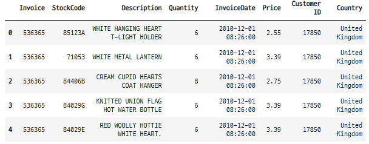


### 3. 데이터 전처리
- missing value 가 있는지 확인한다.
    - 전체 idnex와 각 컬럼의 count 값을 비교해서 다른 컬럼 확인
- 분석에서 customerid 가 필요하므로 customer id 데이터가 빠진 행은 삭제한다.

```python
df.info()
```

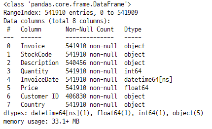

#### 3-1. 컬럼명 변경

```python
df.rename(columns={"Customer ID" : "CustomerID"}, inplace=True)
df.head(2)
```

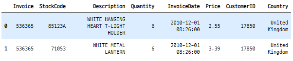


#### 3-2. CustomerID를 기준으로 데이터 삭제

```python
df.dropna(subset=["CustomerID"], inplace=True)
df.tail()
```

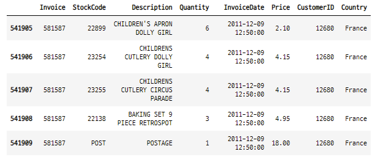

- 전체 길이 변화 확인

```python
df.info()
```

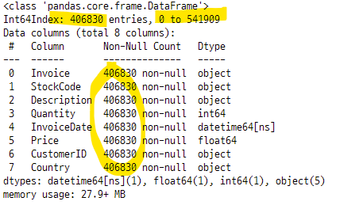


### 4. EDA
- EDA는 데이터의 세부사항을 알아낼 수 있기 때문에 모든 분석에서 매우 중요한 단계이다.
- Quantity 의 min이 -80995 이다.
    - 수량이 마이너스인 경우는 반품된 수량을 의미하므로 이 값을 제거해 준다.
    - 초기주문 수량만 남고 반품 수량이 삭제되므로 수익을 창출하지는 못한 것으로 간주해야한다. 대신에 초기 주문 수량은 고객 유지 user retention 분석에서 사용할 수 있다. 

```python
df.describe()
```

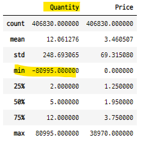

#### 주문수량이 음수인 데이터는 어떻게 처리 하면 좋을까?
- 일반적으로 반품한 경우 주문수량이 음수가 된다. 반품 데이터를 삭제하면 전체 데이터의 주문 수량이 늘어난다.
    - 데이터 분석에서 반품 수량을 삭제하는 것이 좋은 지는 고려해 봐야할 문제이다. 
- describe 행렬을 전치시켜서 가로로 보기

```python
df.describe().T
df.describe().transpose()
```

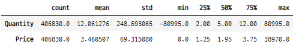

### 5. 주문을 두번 이상 한 고객의 비중
- 전체 고객 중 69.97%가 두번 이상 주문한다는 것을 알 수 있다.
    - 고객들이 여러주문을 한다.
    - 이것은 고객의 retention이 있다는 것을 의미한다.

- 고객별로 그룹바이하고 주문건에 대한 수량 계산

```python
n_orders = df.groupby(["CustomerID"])["Invoice"].nunique()
n_orders

>>>

CustomerID
12346     2
12347     7
12348     4
12349     1
12350     1
         ..
18280     1
18281     1
18282     3
18283    16
18287     3
```

- 주문 수량이 2개 이상인 데이터만 선택

```python
np.sum(n_orders > 1)

>>>

3059
```
- 2개 이상 주문한 고객의 비중

```python
multi_orders_perc = np.sum(n_orders > 1) / df["CustomerID"].nunique()
multi_orders_perc

>>>

0.69967978042086

print(f"{100 * multi_orders_perc : .2f}% of cumstomers ordered more than one")

>>>

69.97% of cumstomers ordered more than one
```

#### 5-1. 5개 이상 주문한 고객의 비중
- 고객별로 그룹 > 주문수량이 5보다 큰 데이터 선택 > 전체 주문수량으로 나누어준다.

```python
n_orders_5 = df.groupby("CustomerID")["Invoice"].nunique() > 5
n_orders_5_perc = np.sum(n_orders_5) / df["CustomerID"].nunique()
print(f"{100 * n_orders_5_perc : .2f} % customer ordered more than 5")

>>>

24.86 % customer ordered more than 5
```

### 6. 고객 당 주문수 분포 확인
- 50개 이상 주문하는 고객은 매우 드물다는 것을 알 수 있다.

```python
%matplotlib inline

plt.figure(figsize=(9, 7))
ax = sns.distplot(n_orders, kde=False, hist=True)
ax.set(title="Distribution of number of orders per customer",
      xlabel="# of orders",
      ylabel="# of customers")
plt.show() ;
```

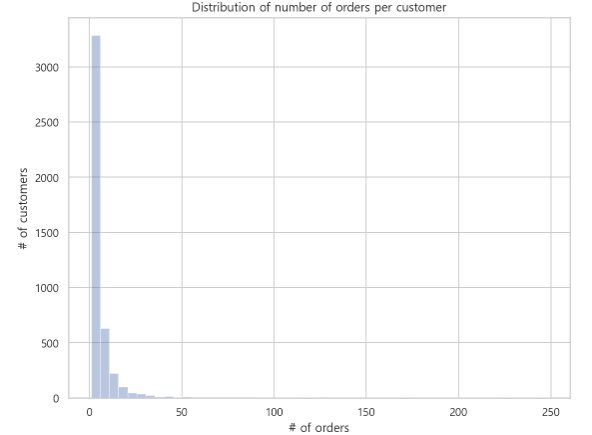

### 7. cohort analysis
- 이 데이터셋에는 고객 가입 날짜는 없다. 그러므로 코호트 분석의 대상을 첫 구매날짜 기준으로 할 수 있다.
    - 데이터셋에 과거 데이터가 포함되어 있지 않으므로 유저별 실제 첫 구매날짜는 확인 할 수 없다.
    - 이 리테일 업체의 구매 내역 전체를 확인 해봐야지만 알 수 있는 단점이 있다.

#### 7-1. 중복데이터 삭제
- drop_duplicates()함수를 사용하여 중복데이터를 제거할 수 있다.
- 현재 데이터의 수

```python
len(df)

>>>

406830
```

- 데이터 삭제

```python
df2 = df[["CustomerID", "Invoice", "InvoiceDate"]].drop_duplicates()
df2.head()
```

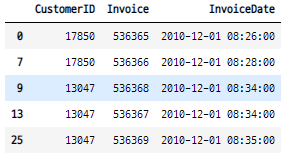

- 중복 데이터 삭제 후 데이터 수

```python
len(df2)

>>>

22221
```

### 9. 코호트 그룹 생성
- CohortMonth : 고객별 주문날짜 중 첫 번째 구매 날짜를 기준으로 한 월별 코호트
- OrderMonth : 구매 날짜에서 월만 계산

#### 9-1. 날짜 형식 변경 방법
- 2010-02
    - dt.strftime("%Y-%m")
    - apply(lambda x : x.strftime("%Y-%m"))
    - dt.to_period("M")

#### 9-2. OrderMonth 생성
- 주문 날짜의 형식을 년-월로 변환

```python
df2["OrderMonth"] = df2["InvoiceDate"].dt.to_period("M")
df2.head()
```

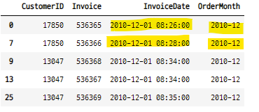

#### 9-3. CohortMont 생성
- 고객별로 주문한 데이터를 그룹바이하고 가장 작은 날짜의 데이터를 계산한다.
- 한 고객이 최초로 주문한 데이터가 된다.
- 코호트 그룹

```python
df2["CohortMonth"] = df2.groupby("CustomerID")["InvoiceDate"].transform("min")\
.dt.to_period("M")
df2.head()
```

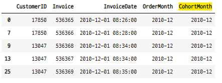


### 10. 각 그룹별 고유 고객수 계산
- 코호트 그룹과 주문 날짜로 그룹바이한 후 고객 아이디 데이터의 갯수를 계산한다.
- 즉 코호트 그룹별로 각 주문월에 얼마나 많은 고객이 주문을 했는지 알 수 있다.
    - 현재 코호트 분석의 목적

```python
df2_cohort = df2.groupby(["CohortMonth", "OrderMonth"]) \
.agg(n_customer=("CustomerID", "nunique")) \
.reset_index(drop=False)

df2_cohort.head()
```

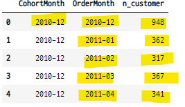


#### 10-1. 2011-05월 그룹의 주문 현황
- 2011-05 그룹은 첫 단위기간은 2011-05월부터 시작한다.

```python
df2_cohort[df2_cohort["CohortMonth"] == "2011-05"]
```


### 11. period_number 추가
- CohortPeriod
- 코호트와 구매월 사이의 기간 수
- **attrgetter() 함수** : operator 모듈의 내장 함수
    - key 값 정렬할 때 사용할 수 있다. 

#### 11-1. OrderMonth - CohortMonth
- OrderMonth : 주문한 날짜의 월 데이터
- CohortMonth : 주무한 날짜 중에서 처음 주문한 월 데이터
- OrderMonth - CohortMonth = <0 * MonthEnds>    
    - 이러한 방식으로 계산하려면 데이터의 타입이 datetime 형식이어야 한다.

```python
df2_cohort["CohortPeriod"] = (df2_cohort.OrderMonth - df2_cohort.CohortMonth) \
.apply(attrgetter("n"))

df2_cohort.head()
```

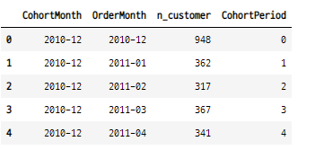

#### 11-2. datetime 인 데이터끼리 연산
- n * MonthEnds 의 형태로 반환된다. attrgetter()를 사용하여 n만 선택할 수 있다.

```python
test = df2_cohort.OrderMonth - df2_cohort.CohortMonth
test

>>>

0     <0 * MonthEnds>
1          <MonthEnd>
2     <2 * MonthEnds>
3     <3 * MonthEnds>
4     <4 * MonthEnds>
           ...       
86         <MonthEnd>
87    <2 * MonthEnds>
88    <0 * MonthEnds>
89         <MonthEnd>
90    <0 * MonthEnds>
Length: 91, dtype: object
```

```python
test[:10].apply(attrgetter("n"))

>>>

0    0
1    1
2    2
3    3
4    4
5    5
6    6
7    7
8    8
9    9
```

### 12. cohort pivot table
- row : 주어진 코호트 집단의 데이터 (첫구매한 월의 집단의 데이터)
- column : 특정기간의 값 (코호트 기간별 데이터)    

```python
cohort_pivot = df2_cohort.pivot_table(index="CohortMonth",
                                     columns="CohortPeriod",
                                     values="n_customer")
cohort_pivot
```

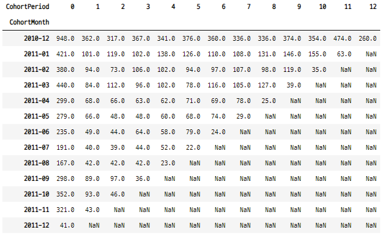

### 13. retention matrix
- 각 행의 값을 행의 첫 데이터로 나누어야 한다.
- 즉 첫번째 구매월의 값을 다음 기간의 값으로 나누어 주어야 한다. 

```python
cohort_size = cohort_pivot.iloc[:, 0]
retention_matrix = cohort_pivot.divide(cohort_size, axis=0)
retention_matrix
```

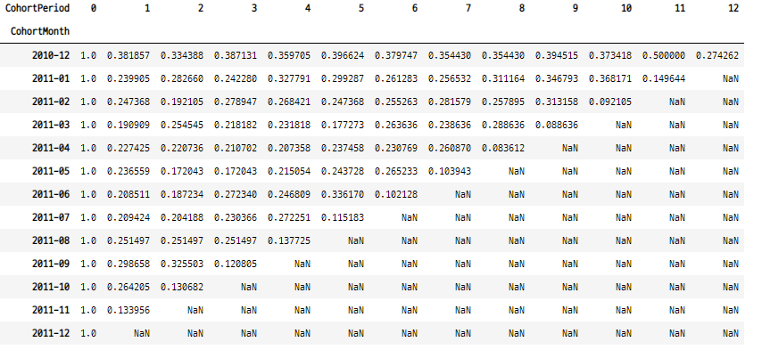


### 14. heatmap
- cohort size : 첫 구매월별 데이터, 즉 코호트 집단별 첫 주문수
- 히트맵에 cohort size 데이터를 추가해 준다.

#### 14-1. 히트맵의 스타일 설정
- 두개의 부분으로 나누어준다.
- 하나는 cohort size 값이 들어가는 공간이고, 다른 하나는 retention matrix 가 들어가는 공간이다.

- 두개의 plot을 1:11 비율로 나누는 방법

```python
%matplotlib inline
with sns.axes_style("white") :
    fig, ax = plt.subplots(1, 2, figsize=(12, 8), sharey=True,
                          gridspec_kw={"width_ratios" : [1, 11]})
```

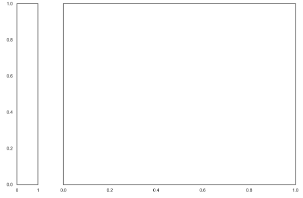


#### 14-2. retention matrix 를 히트맵으로 나타내기
- 코호트 그룹이 단위기간을 지날 때마다 첫 기간에 비해서 어떻게 달라지는 쉽게 알 수 있다.
- 즉 첫 기준 데이터가 시간이 지날 수록 어떻게 변하는지 알 수 있다.

```python
with sns.axes_style("white") :
    fig, ax = plt.subplots(1, 2, figsize=(12, 8), sharey=True,
                         gridspec_kw={"width_ratios" : [1, 11]})

### heatmap : retention matrix

sns.heatmap(retention_matrix,
           mask=retention_matrix.isnull(),
           annot=True,
           fmt=".0%",
           cmap="RdYlGn",
           ax=ax[1])
ax[1].set_title("Monthly Cohort : User Retention", fontsize=16)
ax[1].set(xlabel="# of periods", ylabel="")

### heatmap : cohort size

cohort_size_df = pd.DataFrame(cohort_size)
cohort_size_df = cohort_size_df.rename(columns={0 : "cohort_size"})
white_cmap = mcolors.ListedColormap(["white"])
sns.heatmap(cohort_size_df,
           annot=True,
           cbar=False,
           fmt="g",
           cmap=white_cmap,
           ax=ax[0])
ax[0].set(xlabel="", ylabel="# of cohort month")

fig.tight_layout()
plt.show() ;
```

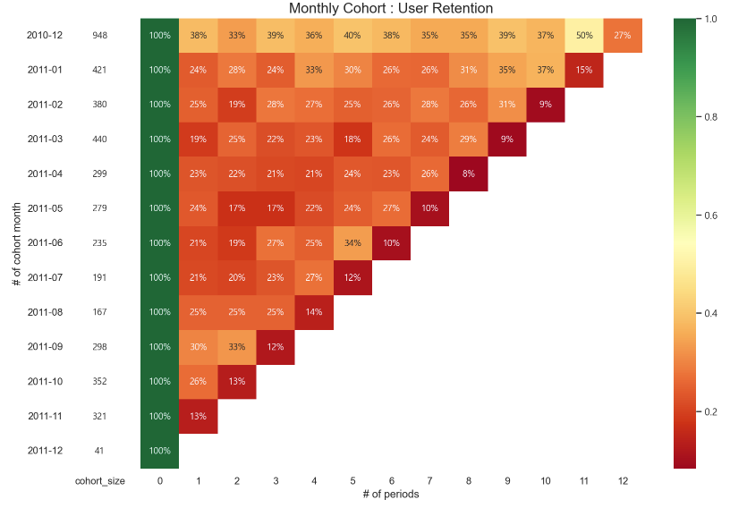


### 참고
- https://towardsdatascience.com/a-step-by-step-introduction-to-cohort-analysis-in-python-a2cbbd8460ea
