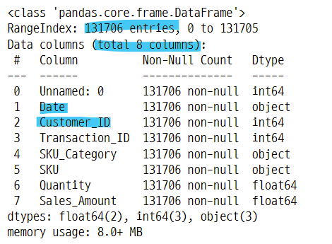
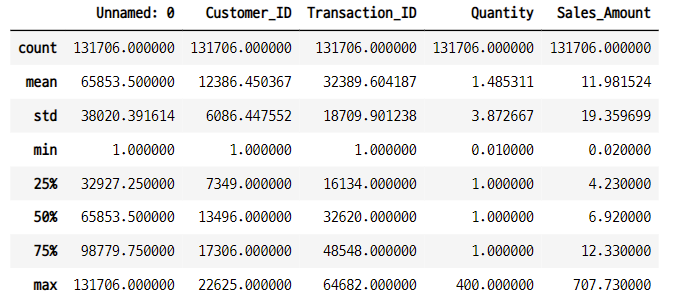
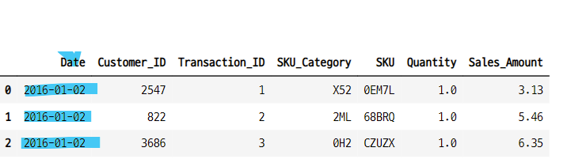
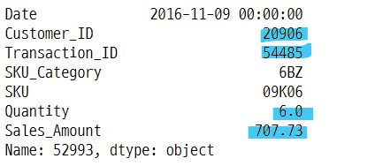
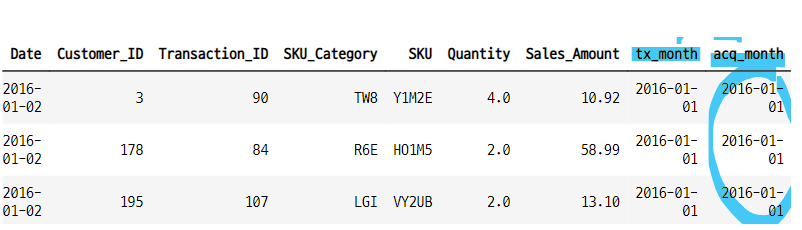

# 코호트 4

## cohort analysis with python
- https://www.activestate.com/blog/cohort-analysis-with-python/
- 데이터 분석은 우리에게 어떤 트랜드에 대한 통찰을 준다.
- 많은 경우 데스크톱 브라우저보다 스마트폰을 사용하는 방문자나 어떤 구매금액과 같은 그룹과 연관지으면 더 가치가 생긴다.
- 특정한 시간 범위에서의 공통된 특성을 공유하는 그룹 혹은 코호트 별로 데이터를 분석하면 더 효과적이다.

### process
- install the runtime environment
- import and clean the dataset
- assign cohorts
- calcuate retention reates
- segment data by quantity and revenue
- forecast the corhot data

## python

### 1. 데이터 임포트

```python
url = "https://raw.githubusercontent.com/nickmancol/python-cohorts/main/data/scanner_data.csv"

df = pd.read_csv(url)
```

### 2. 데이터 확인
- 13만개의 데이터 
- null data 없음
- 8개의 컬럼

```python
df.info()
```


```python
df.describe()
```



#### 주문기간의 처음과 끝
- 2016-02-01
- 2016-12-31

```python
df["Date"].min(), df["Date"].max()

>>>

('01/02/2016', '31/12/2016')
```

### 3. 데이터 전처리, 클리닝
- 원본 df
- copy dff

```python
df2 = df.copy()
df2.columns

>>>

Index(['Unnamed: 0', 'Date', 'Customer_ID', 'Transaction_ID', 'SKU_Category',
       'SKU', 'Quantity', 'Sales_Amount'],
      dtype='object')
```

#### 불필요한 컬럼 제거

```python
df2.drop(["Unnamed: 0"], axis=1, inplace=True)
df2.head(3)
```


#### 날짜 형식 변환
- to_datetime(컬럼, format=현재날짜형식) : 년-월-일 형식으로 변환해 준다.

```python
df2["Date"] = pd.to_datetime(df2["Date"], format="%d/%m/%Y")
df2.head(3)
```



#### 다른 방법으로 날짜 형식 변환
- dt.strftime("")

```python
df2["Date"].dt.strftime("%Y-%m-%d")

>>>

0         2016-01-02
1         2016-01-02
2         2016-01-02
3         2016-01-02
4         2016-01-02
             ...
131701    2016-07-04
131702    2016-07-04
131703    2016-07-04
131704    2016-07-04
131705    2016-07-04
Name: Date, Length: 131706, dtype: object
```

- apply(lambda x : x.strftime("))

```python
df2["Date"].apply(lambda x : x.strftime("%Y-%m-%d"))

>>>

0         2016-01-02
1         2016-01-02
2         2016-01-02
3         2016-01-02
4         2016-01-02
             ...
131701    2016-07-04
131702    2016-07-04
131703    2016-07-04
131704    2016-07-04
131705    2016-07-04
Name: Date, Length: 131706, dtype: object
```

- dt.to_period("d") :d, M, Y 등 사용가능

```python
df2["Date"].dt.to_period("d")

>>>

0         2016-01-02
1         2016-01-02
2         2016-01-02
3         2016-01-02
4         2016-01-02
             ...
131701    2016-07-04
131702    2016-07-04
131703    2016-07-04
131704    2016-07-04
131705    2016-07-04
Name: Date, Length: 131706, dtype: period[D]
```

#### 중복 데이터 확인
- df.duplicated([컬럼1, 컬럼2, ...], keep=first) : 앞, 뒤 행의 중복 여부를 확인하여 어떤 것을 남길 것인지 T, F로 반환해 준다. True이면 삭제, False면 남겨둔다.
    - keep=first : 앞 False, 뒤 True : 앞을 남겨두고, 뒤를 삭제한다. 
    - keep=last : 앞 True, 뒤 False : 앞을 삭제하고 뒤를 남겨둔다.
    - keep=False : 중복인 경우 앞, 뒤 모두 True를 반환 : 둘다 삭제한다.
- df.drop_duplicated([컬럼1, 컬럼2, ...], keep=first) : keep에 따라서 unique한 1개의 key값만 남기고 나머지 중복은 제거 하여 데이터 프레임을 반환한다.

#### 날짜와 고객id로 중복 확인
- 특정날짜에 한 고객이 주문한 횟수
- 2022-05-05 에 A 고객이 10건 주문했다면 True가 9개, False가 1개로 반환 된다. 
    - T, F 위치는 keep인수값에 따라 달라짐.

- 현재 데이터의 길이

```python
origin_len = len(df2)
origin_len

>>>

131706
```

- 중복데이터를 데이터의 길이

```python
dupli_len = df2.duplicated(["Date", "Customer_ID"]).sum()
dupli_len

>>>

68979
```

- 중복 데이터 제거 후 데이터 길이

```python
n_order_one_customer = origin_len - dupli_len
n_order_one_customer

>>>

62727
```

### 4. 중복 데이터를 그룹화
- 특정날짜에 구매한 고객별로 그룹화
    - 2022-05-05에 A가 10번 구매한 경우 이것을 groupby하고, 컬럼별로 연산 한다.
- agg({}) 함수를 사용하여 그룹화의 연산을 각 컬럼별로 적용할 수 있다.    
- drop_duplicated() 함수사용하지 않고 groupby로 중복 데이터를 사용

```python
df22 = pd.DataFrame(df2.groupby(["Date", "Customer_ID"]) \
                   .agg({"Transaction_ID" : max,
                        "SKU_Category" : max,
                        "SKU" : max,
                        "Quantity" : sum,
                        "Sales_Amount" : sum})).reset_index()

print("날짜별 고객별 주문건으로 통합한 후 데이터의 길이 : ", len(df2))
print("gorupby 한 후의 길이 = duplicated 를 제거한 길이 비교 : ", len(df22) == n_order_one_customer)

>>>

날짜별 고객별 주문건으로 통합한 후 데이터의 길이 :  131706
gorupby 한 후의 길이 = duplicated 를 제거한 길이 비교 :  True
```

#### 주문금액이 가장 큰 데이터 확인
- 어떤 고객이 주문 했을까?

```python
# 가장 큰 주문금액의 인덱스
df22["Sales_Amount"].argmax()

>>>

52993

# 가장 큰 주문 금액
df22["Sales_Amount"].max()

>>>

707.73
```

#### 주문금액이 가장 큰 주문건

```python
top_order = df22.iloc[df22["Sales_Amount"].argmax()]
top_order
```




#### 고객아이디 20906의 주문 현황
- 2016-06-01, 07-17, 11-09 3날짜에 주문을 했다.
- 11-09 주문한 금액이 가장 크다

```python
df22[df22["Customer_ID"] == top_order["Customer_ID"]]
```


- 날짜별 모든 주문건


### 5. tx_month, acq_month
- 시간기준으로 분석할 수 있는 그룹으로 분할한다.
- 각 거래에 대한 cohort 할당
- 두개의 컬럼 생성
    - tx_month : 주문 날짜 : order_month
    - acq_month : 고객 별 최초 주문 날짜 : cohort_month

#### tx_month
- 주문한 날짜의 월을 만들고, 날을 1일로 통일
- tx_month에서 최소값이 코호트 그룹의 기준이 되므로, 날짜를 1일로 통일하고 월을 비교하기위한 것 같다.
    - 2016-02-08 -> 2016-02-01
- 날짜가 다 다르다면 최소값이 달라지기 때문
- 월별로 코호트 그룹을 생성하는 것과 같은 의미이다.

#### acq_month
- tx_month의 최소값
- 즉 첫 주문한 날짜의 월 초
    - 2022-05-24, 2022-06-01 주문 했다면 tx_month는 2022-05-01, 2022-06-01 이고, acq_month는 2022-05-01이 된다.
- 일자를 통일해서 월별로 코호트 그룹화한다. 
- cohort_month와 같은 의미이다. 

#### 주문한 월 데이터 생성
- tx_month
- 주문한 날짜 데이터에서 년, 월 데이터를 가져온다. 일은 1일로 통일해준다. 
    - 일은 삭제해도 됨
- dtype : object

```python
df22["tx_month"] = df22["Date"].apply(lambda x : dt.date(x.year, x.month, 1))
df22.head(3)
```


#### dt.date(x.year, x.month, x.day) test
- dt.date() 함수 테스트

```python
test = df22.iloc[1]["Date"]
test

>>>

Timestamp('2016-01-02 00:00:00')
```

- 년, 월, 일 데이터 가져오기

```python
dt.date(test.year, test.month, test.day)

>>>

datetime.date(2016, 1, 2)
```

- 년, 월, 일의 값을 고정 시킬 수 있다.

```python
dt.date(test.year, 10, test.day)

>>>

datetime.date(2016, 10, 2)
```

- 년월일 데이터를 가져오고 날짜 형식을 바꿀 수 있다.

```python
dt.date(test.year, 10, test.day).strftime("%Y-%m-%d-%a-%b")

>>>

'2016-10-02-Sun-Oct'
```

#### cohort 그룹 생성
- tx_month의 최소값
- 첫 주문을 한 달의 첫 날

```python
df22["acq_month"] = df22.groupby("Customer_ID")["tx_month"].transform("min")
df22.head(3)
```



### 5-1. 10회 주문한 고객의 주문 현황 분석
- 14845 고객의 주문 현황
- 총 몇개를 주문했나?
- 총 주문 금액은 얼마인가?
- 어떤 상품을 많이 구매했는가?

#### 10회 주문한 고객

```python
test = df22["Customer_ID"].value_counts() == 10
test.sort_values(ascending=False)[:10]

>>>

10610    True
6764     True
14845    True
10137    True
18920    True
15911    True
18536    True
15512    True
17544    True
17815    True
```

#### 이 중 14845 고객의 주문 현황
- 2016-06-03 에 처음 주문한 이후 12월까지 꾸준히 재구매 했다.

```python
customer_14845 = df22.loc[df22["Customer_ID"] == 14845]
customer_14845
```


