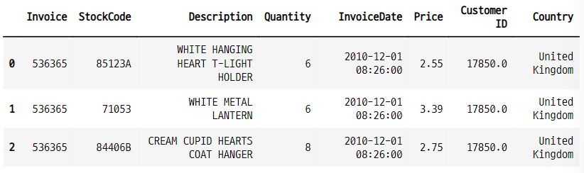
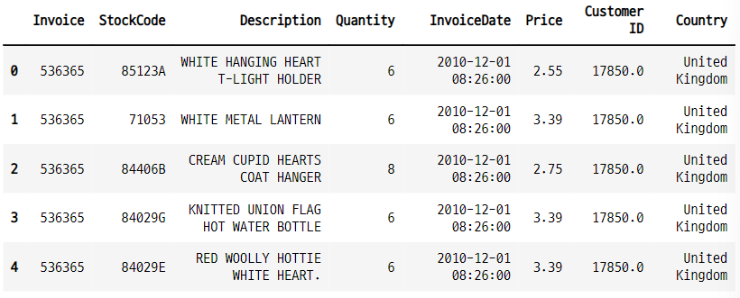
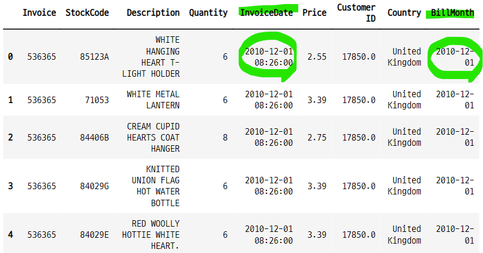

# 코호트 5

## cohort analysis and customer segmentation with python
- https://github.com/kennedykwangari/Cohort-Analysis-and-Customer-Segmentation-with-Python/blob/master/Cohort_Analysis.ipynb

### contents
- import libraries and read dataset
- exploratory data analysis
- cohort analysis
    - what is cohort analysis?
    - cohort analysis with pyhon
- RFM analysis for customer segmentation
    - what is RFM analysis
    - RFM analysis with python
- k-means clustering

### cohort analysis
- 코호트는 데이터 세트에서 분석을 위해 관련 그룹으로 나누는 행동 분석의 하위 집합과 같다.
- 코호트는 **정의된 시간 범위** 내에서 공통적인 특성 또는 경험을 공유한다. 
    - 특정한 날에 가입한 유저
    - 특정한 날에 홈페이지에서 물건을 구매한 유저
    - 특정한 제품을 구매한 유저
    - 특정한 채널을 통해 유입된 유저
    - 특정한 프로모션, 마케팅 상품을 적용받은 유저들 등....
- 코호트는 고객의 life_cycle 전반에 걸친 패턴을 명확하게 할 수 있다.
- 이러한 시간 패턴을 통해서 특정 코호트에 맞게 서비스를 조정하고 변화시킬 수 있다.
- 코호트 분석과 코호트 연구 cohort study가 관련 있을 수 있지만, 다르다.

### 1. 라이브러리 임포트 
- import libraries and read dataset
- 새로 설치하는 모듈이나 패키지가 있는지 확인하고, 반드시 어떤 패키지들이 함꼐 설치되는지, 기존에 설치된 다른 라이브러리하고는 충돌이 없는지 확인 할 것!!!

- os 패키지로 현재 디렉토리의 파일 검색

```python
import numpy as np
import pandas as pd
import matplotlib.pyplot as plt
import datetime as dt
import seaborn as sns
import os

print(os.listdir("./"))
```

### 2. 데이터 임포트

```python
!ls ../../all_data/cohort_data

>>> print

online_retail.xlsx
relay-foods.xlsx
```

- 엑셀 파일 임포트
    - **sheet_name 인수로 어떤 시트의 데이터를 불러올지 설정할 수 있다.**

```python
df = pd.read_excel("../../all_data/cohort_data/online_retail.xlsx",
                  sheet_name="Year 2010-2011")
df.head(3)
```


### 3. 데이터 확인

```python
df.info()

>>> print

<class 'pandas.core.frame.DataFrame'>
RangeIndex: 541910 entries, 0 to 541909
Data columns (total 8 columns):
 #   Column       Non-Null Count   Dtype
---  ------       --------------   -----
 0   Invoice      541910 non-null  object
 1   StockCode    541910 non-null  object
 2   Description  540456 non-null  object
 3   Quantity     541910 non-null  int64
 4   InvoiceDate  541910 non-null  datetime64[ns]
 5   Price        541910 non-null  float64
 6   Customer ID  406830 non-null  float64
 7   Country      541910 non-null  object
dtypes: datetime64[ns](1), float64(2), int64(1), object(4)
memory usage: 33.1+ MB
```

#### 주문수량과 가격의 최소값이 음수이다.
- 반품 된 주문수량이 포함 된 것

```python
df.describe()
```


#### 분석용 데이터 카피

```python
dff = df.copy()
dff.head()
```


### 4. 월별 판매금액 현황 그래프
- BillMonth : 주문날짜를 년-월-1일 로 바꾼 데이터
   - 주문날짜를 월 단위로 통일 시켜주기 위한 방법 
   - OrderMonth
   - tx_month

- dt.datetime() 을 사용하여 새로운 시계열 데이터를 생성해 준다.

```python
def monthly(x) :
    return dt.datetime(x.year, x.month, 1)

dff["BillMonth"] = dff["InvoiceDate"].apply(monthly)
dff.head()    
```



