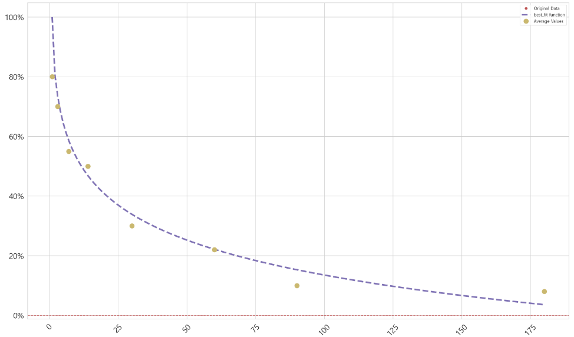

# Theseus 테세우스


- 오픈소스 라이브러리
- 코호트 분석과 마케팅 퍼포먼스 분석에 도움을 준다.
    - 보유 프로파일 구축
    - DAU 수준 예측
    - 코호트 결합
    - 연령별 코호트 분할
    - 마케팅 예산계획
    - 시나리오 분석
    - 마케팅 캠페인 분석
    - 수익 예측 및 미디어 믹스 모델 등에 사용할 수 있다. 
- 독립형 분석 프로젝트와 프로그래밍 방식의 비즈니스 인텔리전스 환경에서 사용하도록 설계되었다.
- **베타 버전이라 버그가 있을 수 있다.**
    - 거시적인 그림을 그릴때 유용할 것 같다. 그러나 어느정도 정확도가 있는지는 확인 해봐야 할 것 같다.
- `https://github.com/ESeufert/theseus_growth`

### 마케팅 용어 : Active User 활성사용자 
- 어떤 행동을 활성사용자로 정의할 것인지는 정하기 나름
- **DAU : Daily Active Users**
    - 일별 활동 사용자수 : 앱 로그인, 구매, 재구매, 검색, 클릭 등의 활동
    - 같은 사용자가 여러번 활동을 해도 1로 카운팅한다.
- **MAU : Monthly Active Users**
    - 월별 활동 사용자수 : 한달간 활동한 사용자의 총수
- DAU, MAU 수치는 retention 수치와 함께 분석해야 의미가 있다.
- **DAU/MAU : DAU MAU Ratio : 활동유저 비율**

## 1. 사용방법
- th.create_profile() : retention profile 생성
    - days
    - retention_values
- th.plot_retention() : retention profile 그래프
- th.project_cohorted_DAU() : retention profile 기반으로 예측, 데이터프레임 반환
    - profile
    - periods
    - cohorts
    - DAU_target
    - DAU_target_timeline
    - start_date
- th.DAU_total() : 코호트 기간별 합계
- th.get_DNU() : 목표기간 중 주어진 데이터 이후의 예측값
- th.plot_forward_DAU_stacked() : retention matrix()를 누적 그래프로 그려줌
    - forward_DAU
    - forward_DAU_labels
    - forward_DAU_dates
    - xticks(날짜)와 라벨 값 변경 가능
- th.combine_DAU() : 두 DAU를 합해준다. total 값을 concat() 한 것과 같다.
    - DAU_totals : [ttl1, ttl2]
    - labels : ["fb", "gl"]
    - 누적 그래프로 나타낼 수 있다.

### 1-1. retention profile 을 만든다.
- days : 고객이 서비스를 처음 경험한 시작점, 1부터 시작
    - cohortmonth 에 해당한다.
    - 공통 경험의 단위(월, 일, 요일, 어떤 프로모션의 날짜 등)
- retention values : 유지율 값, days에 해당하는 데이터
    - day와 retention은 길이가 같아야 한다.
    
### 1-2. curve
- 내장 된 여러가지 함수를 적용하여 데이터와 가장 유사한 곡선을 찾는다.
    - 오차가 작은 함수를 선택하는 방식
    - log, exp, linear, quad, weibull, power, interpolate
- form 매개변수를 설정하면 특정함수를 데이터에 강제 적용할 수 있다. 
- form 매개변수 설정이 없으면 자동으로 적합한 함수를 찾는다.

### 1-3. retention_profile
- retenion_profile의 다양한 결과값들이 반환된다.
    - x_collapsed y_collapsed : 확인 필요
    - params : 함수별 성능 값
    - errors : 함수별 오차 값
    - best_fit : 최적의 함수
    - retencion_projection : 최적의 함수에 의해 만들어진 값
        - 처음 주어진 데이터에 이어서 만들어진 값들이 추가 된다. 

### 1-4. 패키지 임포트

```python
import theseus_growth as th

th = th.theseus()
th

>>> print

<theseus_growth.theseus at 0x19682858788>
```

### 1-5. retention profile 만들기
- ret_days와 ret_avg를 인수로 넣는다.

```python
ret_days = [1, 3, 7, 14, 30, 60, 90, 180]
ret_avg = [80, 70, 55, 50, 30, 22, 10, 8]
facebook = th.create_profile(days=ret_days, retention_values=ret_avg)

facebook
```


### 1-6. 결과값 확인
- 함수의 성능

```python
facebook["params"]

>>> print

{'log': array([11.69432981,  0.85932489, 91.18858849]),
 'exp': array([6.81055506e+01, 4.01937194e-02, 1.00786303e+01]),
 'linear': array([-0.36314103, 58.10116222]),
 'quad': array([ 4.23356783e-03, -1.09641452e+00,  6.94411850e+01]),
 'weibull': array([136.70678858,   0.99893811]),
 'power': array([88.3002565,  0.3123284])}
```

- 함수별 오차값

```python
facebook["errors"]

>>> print

{'log': 61.1068291195336,
 'exp': 101.38898187621713,
 'linear': 1412.367783723572,
 'quad': 364.49321231183075,
 'weibull': 12824.814624812376
```

- 최적 함수

```python
facebook["best_fit"]

>>> print

'log'
```
### 1-7. 코호트 예측 plot
- 최초에 주어진 ret_days와 ret_avg 데이터를 기반으로 가장 오차가 작은 함수의 곡선을 반환해준다.
- 이 곡선에 따르면 다른 날짜에 대한 retention_value 예측이 어느정도 가능하다.

```python
%matplotlib inline

th.plot_retention(facebook)
```


## 2. 예측

### 2-1. DAU projection
- **forward DAU projection** 라고 부른다.
- 새로운 사용자 집단 데이터와 retention_profile의 함수를 기반으로 설정한 기간의 DAU를 예측한다.
- 매일 서비스에 가입한 신규 사용자 수에 대한 코호트 집단 list 만들기
    - project_cohorted_DAU 함수 : 서비스에 존재하는 DAU 수치를 포함하는 데이터 프레임으로 만들어 준다.
    - profile : retention profile
    - periods : 앞으로 예측할 기간의 수
    - cohorts : 새 사용자 값 list, 매일 새로 유입된 사용자의 수
    - start_date : 새로운 집단이 추가되고 예측이 시작한 날짜
- cohort matrix 를 반환해준다.
    - cohort 인수에 입력 된 새 사용자수는 첫 코호트 그룹별 고객수를 의미한다.
    - index : 코호트 그룹 : 공통 경험을 갖는 기준
    - column : 코호트 기간 : 공통 경험이 있은 후의 단위 시간
        - 월, 일, 요일, 어떤 규칙적인 기간 등이 될 수 있다.
    - 즉 첫째날로부터 50일 후, 또는 50개월 후 등의 코호트 기간에 유입될 고객수를 예측해준다.
- 그래프로 그려보면 retention_profile 그래프와 유사하다.
    - retention_profile에서 구한 최적 함수를 기반으로 예측 데이터를 만들어 준다.

### 2-2. 추가기능
- DAU 목표에 도달하는 데 필요한 신규 사용자 집단의 규모를 생성하는데 사용할 수도 있다.
    - DAU 목표가 1000이 아니라 10000일 경우 얼마나 새로운 집단이 필요한지를 계산해준다.

### 2-3. 예측 데이터 생성
- 새로운 집단 생성
- 최적 함수를 기반으로 한 예측 데이터 생성

```python
cohorts = [1000, 1000, 1000, 1000, 1000]

facebook_DAU = th.project_cohorted_DAU(profile=facebook, periods=50,
                                      cohorts=cohorts, start_date=1)
facebook_DAU
```


- 일별 그래프

```python
plt.figure(figsize=(12, 10))
facebook_DAU.iloc[0].plot()
plt.xlabel("ret_days")
plt.ylabel("ret_val")
plt.show() ;
```


### 2-4. DAU_total
- facebook_DAU에서 열별로 합산한 결과를 반환하다.
- 즉 각 코호트 기간별 유입된 총 고객수이다.
    - 50개의 코호트 기간동안 5개의 코호트 집단에 존재하는 DAU의 총합이다.    

```python
## pd.DataFrame(facebook_DAU.sum(axis=0)).T 와 같다.

facebook_total = th.DAU_total(facebook_DAU)
facebook_total
```


## 3. DAU 목표 예측
- DAU 목표값이 1000이 아니라 10000이라고 할때 이 목표를 달성하기 위한 필요한 추가 집단의 규모를 계산할 수 있다.
    - 즉 어떤 기간동안 x 값을 얻기위한 예측
    - DAU_target : DAU의 목표값
    - DAU_target_timeline : 목표값을 얻기위한 기간
- 차후 10일간 10000명에 도달하기 위한 DNU는 1613, 1757, 1853, 1934 이다.
    - 즉 앞의 5일은 매일 1000명씩 들어온다는 데이터에 기반한다.
    - 이후 5일간의 값을 예측한다.
    
### 3-1. 목표 예측의 의미
- ret_days와 ret_avg 데이터로 retention_profile 을 만든다.
    - 여기에서 비용함수를 반환한다.
- 이 비용함수를 기반으로 새로운 데이터(cohorts 인수)에 대한 retention matrix를 예측할 수 있다. 
- 또한 목표 DAU 값을 설정하고, 이에 도달하기 위한 필요한 추가 DAU를 추정해 볼 수 있다.
- 이 DAU를 판매 갯수로 생각 해 볼수 있다.
    - 어떤 기간에 ret_avg 만큼 판매했었고,
    - 특정 기간동안 목표 판매개수에 도달하기 위해서,
    - 앞으로 남은기간 판매해야할 상품의 갯수

```python
facebook_DAU = th.project_cohorted_DAU(profile=facebook,
                                       periods=50,
                                       cohorts=cohorts,
                                       DAU_target=10000,
                                       DAU_target_timeline=10,
                                       start_date=1)
facebook_DAU
```


### 3-2. 10일째에 10000에 도달한다.
- 10일 이후 점차 줄어든다.
    - retention_profile의 비용함수를 따른다.

```python
fb_ttl_2 = th.DAU_total(facebook_DAU)
fb_ttl_2
```


```python
fb_ttl_2["10"]

>>> print

Value
DAU    10000
Name: 10, dtype: object
```

- 일별 유입량 합계를 그래프로 나타내기

```python
plt.figure(figsize=(12, 10))
plt.plot(fb_ttl_2.T.index, fb_ttl_2.T.values)
plt.axvline(9, c="r", ls="--")
plt.xticks(np.arange(0, 50, 2))
plt.xlabel("ret_day")
plt.ylabel("ret_val")
plt.grid(False)
plt.show() ;
```


### 3-2. get_DNU
- 신규 유저 DNU 값을 반환한다.
    - 코호트 기간으로 6일~10일에 해당하는 예측 값
- project_cohorted_DAU() 에서 목표 타임라인(목표달성 기간) 값에 따라서 cohort_date가 달라진다.

```python
facebook_DNU = th.get_DNU(facebook_DAU)
facebook_DNU.T[:15]
```


## 4. 예측값을 그래프로 나타내기
- 10일 동안 10000명 유입을 목표로 했을때 DAU matrix에 대한 누적 막대그래프
    - forward_DAU : facebook_DAU 값을 사용할 수 있다. 10000명 타겟 DAU 변수
    - forward_DAU_labels : 코호트 집단의 이름 list. 누적 막대 그래프의 라벨. forward_DAU의 코호트 집단의 수와 같아야 한다. 
    - forward_DAU_dates : x축 라벨, 코호트 기간의 수와 같다.
- 이 예측값은 facebook의 retention_profile에서 찾은 최적 함수를 기반으로 만들어진다.
    - 또한 코호트 기간별 값, 목표값, 목표기간값 등을 입력해서 만든 faceboo_DAU를 따른다.

```python
plt.figure(figsize=(12, 10))

th.plot_forward_DAU_stacked(forward_DAU=facebook_DAU,
    forward_DAU_labels=list(facebook_DAU.index),
    forward_DAU_dates=list(facebook_DAU.columns))

plt.show() ;     
```


### 4-1. x축의 기간명, label명 변경
- timedelta() 함수를 사용하여 일자를 증가시킨다.

```python
from datetime import date, timedelta

th.plot_forward_DAU_stacked(forward_DAU=facebook_DAU,
    forward_DAU_labels=["Cohort" + str(x) for x in list(facebook_DAU.index)],
    forward_DAU_dates=[date(2020, 1, 1) + timedelta(days=int(x) - 1) \
                       for x in list(facebook_DAU.columns)])
```


## 5.  새 retention_profile 생성하기
- 새로운 데이터를 만든다.
    - ret_days, ret_val
- profile_max parameter 를 적용
    - retention_profile이 해당 날짜로 예측된다.
    - profile_max 매개변수가 설정되지 않으면 retention_profile은 days 매개변수에 있는 최대값으로 설정된다.

```python
import numpy as np
import random

ret_days = [1, 14, 60]
ret_avg = [40, 22, 10]

print(ret_days, ret_avg)

>>> print

[1, 14, 60] [40, 22, 10]
```

- random 함수를 사용하여 데이터 생성

```python
new_x = []
for i, x in enumerate(ret_days) :
    this_x = x
    for z in np.arange(1, 100) :
        this_y = float(ret_avg[i] *  (1 + (random.randint(-20, 20) / 100)))
        ret_avg.append(this_y)
        new_x.append(this_x)
```

### 5-1. 데이터의 길이
- new_x에 ret_days를 합해서 갯수를 맞춰준다.

```python
len(new_x), len(ret_avg)

>>> print

(297, 300)
```

### 5-2. 데이터별 갯수 확인
- collections 패키지의 Counter 명령어를 사용하면 공통된 데이터별로 갯수를 세어준다.

```python
from collections import Counter

Counter(new_x)

>>> print

Counter({1: 99, 14: 99, 60: 99})
```

### 5-3. ret_days에 new_x 데이터를 합한다.

```python
ret_days.extend(new_x)

len(ret_days), len(ret_avg)

>>> print

(300, 300)
```

### 5-4. google retention_profile 생성
- 구글 사용자의 유입수라고 가정한 데이터로 retention_profile을 생성한다.
    - 데이터와 가장 유사한 비용함수(오차함수)를 계산해준다.

```python
google = th.create_profile(days=ret_days, retention_values=ret_avg,
                          profile_max=180)
print(google)
```


### 5-5. 최적의 함수와 오차값 확인

```python
google["best_fit"]

>>> print

'log'

google["errors"]

>>> print

{'log': 3071.645083999999,
 'exp': 3071.6450840000007,
 'linear': 11699.364950561912,
 'quad': 3071.6450839999998,
 'weibull': 217690.39627384394,
 'power': 4398.590834020101}
```

### 5-6. 딕셔너리안의 데이터 정렬하기
- 딕셔너리의 k, v 는 정렬을 할 수 없다.
- 이것을 정렬하기 위해서 k, v를 list(zip(k, v))을 사용하여 리스트안의 튜플로 바꾼다.
- sorted() 명령으로 정렬, key 인수로 정렬 기준을 설정할 수 있다.
    - operator 모듈의 itemgetter()를 사용하면 튜플의 인덱스를 지정할 수 있다.    

```python
k = list(google["errors"].keys())
v = list(google["errors"].values())
tu = list(zip(k, v))
tu

>>> print

[('log', 3071.645083999999),
 ('exp', 3071.6450840000007),
 ('linear', 11699.364950561912),
 ('quad', 3071.6450839999998),
 ('weibull', 217690.39627384394),
 ('power', 4398.590834020101)]
```

- itemgetter 메서드 임포트 후 정렬
    - 튜플의 인덱스 1을 기준으로 정렬

```python
from operator import itemgetter, attrgetter
sorted(tu, key=itemgetter(1))

>>> print

[('log', 3071.645083999999),
 ('quad', 3071.6450839999998),
 ('exp', 3071.6450840000007),
 ('power', 4398.590834020101),
 ('linear', 11699.364950561912),
 ('weibull', 217690.39627384394)]
```

- google profile의 그래프
    - 최적함수인 log 함수가 적용된 예측곡선

```python
th.plot_retention(google)
```


### 5-7. project_cohorted_DAU
- retention_profile을 기반으로 예측값 구하기 위한 방법
- 새로운 코호트 그룹별 값을 만든다.
- project_cohorted_DAU()의 인수를 설정한다.
    - 목표값 달성 기간에 맞게 예측값을 반환해준다.
- 전체 40일 중, 20일동안 20000명을 달성하기 위한 예측값    

```python
cohorts = [2000, 4000, 1200, 2200, 1700, 1500, 4200, 9200]

google_DAU = th.project_cohorted_DAU(profile=google, periods=50,
                                    cohorts=cohorts, DAU_target=20000,
                                    DAU_target_timeline=20, start_date=1)
google_DAU
```


### 5-8. 코호트 기간별 유입고객의 수

```python
ttl = th.DAU_total(google_DAU)
ttl
```


- 그래프로 확인

```python
plt.figure(figsize=(12, 10))
plt.plot(ttl.T.index, ttl.T.values)
plt.xticks(np.arange(0, 51, 5))
plt.xlabel("ret_day")
plt.ylabel("ret_val")
plt.grid(False)
plt.show() ;
```


### 5-9. 누적 막대그래프
- 기간의 앞쪽에서 그래프가 울퉁불퉁한 이유
    - 코호트 값이 변동적이고 : [2000, 4000, 1200, 2200, 1700, 1300, 4200, 9200]
    - retention 비율이 작다 : [40, 22, 10, 34.4]

```python
th.plot_forward_DAU_stacked(forward_DAU=google_DAU,
    forward_DAU_labels = ["Cohort" + str(x) for x in list(google_DAU.index)],
    forward_DAU_dates = [date(2020, 1, 1) + timedelta(days=int(x) - 1) \
                        for x in list(google_DAU.columns)])
```


## 6. combine DAU
- facebook_DAU와 google_DAU를 합칠 수 있다.
- 각각의 DAU 누적그래프를 더해준다. 
    - 두 그래프를 얹힌다.
- DAU_total 값을 사용한다.    

```python
google_total = th.DAU_total(google_DAU)

combined_DAU = th.combine_DAU(DAU_totals=[facebook_total, google_total],
                             labels=["facebook", "google"])
combined_DAU
```


### 6-1. 두 데이터의 누적 그래프

```python
th.plot_forward_DAU_stacked(forward_DAU=combined_DAU,
    forward_DAU_labels=list(combined_DAU.index),
    forward_DAU_dates=[date(2020, 1, 1) + timedelta(days=int(x) - 1)\
                      for x in list(combined_DAU.columns)])
```

